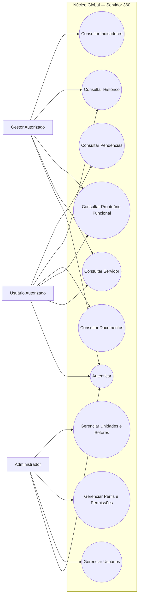

# Servidor 360 — Diagrama de Casos de Uso Global

## 1. Objetivo

Este diagrama representa apenas os casos de uso compartilhados pelo **núcleo global do Servidor 360**.

## 2. Observação Arquitetural

Esses casos de uso representam serviços compartilhados que deverão ser utilizados pelos módulos de negócio.

O módulo de Afastamentos, por exemplo, não deverá implementar sua própria autenticação ou cadastro de servidores. Ele deverá consumir os recursos disponibilizados pelo núcleo global.
