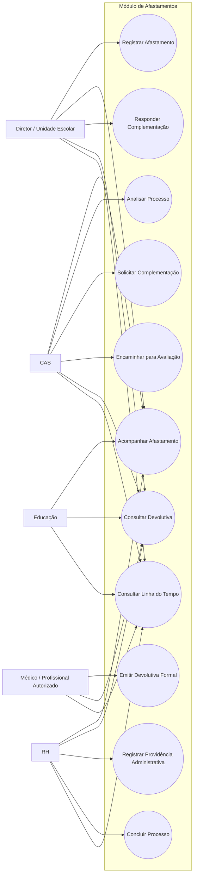
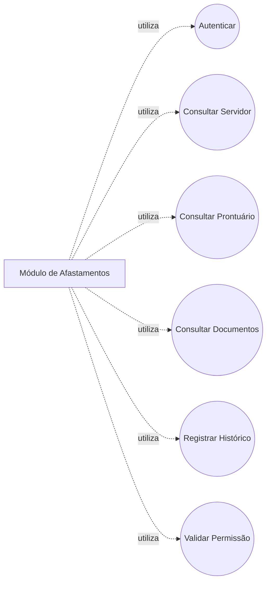
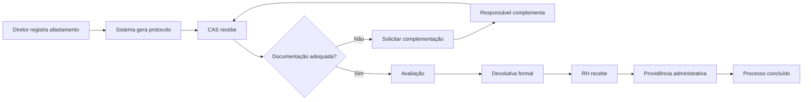

# Servidor 360 — Diagrama de Casos de Uso do Módulo de Afastamentos

## 1. Diagrama Principal

---

## 2. Dependências com o Núcleo Global

O módulo reutiliza funcionalidades globais do Servidor 360.

## 3. Fluxo Principal

