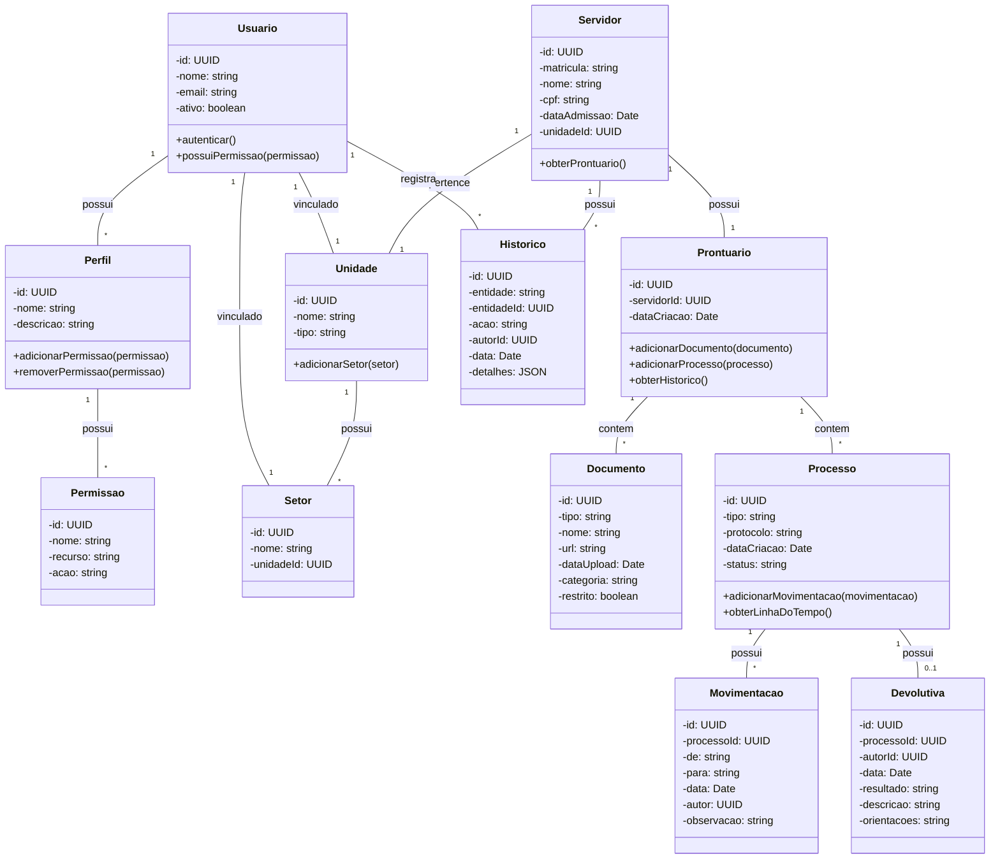

# Servidor 360 — Diagrama de Classes

## 1. Objetivo

Este documento apresenta o diagrama de classes UML que representa a estrutura conceitual do Servidor 360, mostrando as principais entidades e seus relacionamentos.

---

## 2. Diagrama de Classes UML

---

## 3. Descrição das Classes

### 3.1 Usuário
Representa um usuário do sistema com acesso ao portal.

**Atributos:**
- `id`: Identificador único
- `nome`: Nome completo do usuário
- `email`: E-mail para autenticação
- `ativo`: Indica se o usuário está ativo

**Métodos:**
- `autenticar()`: Realiza autenticação no sistema
- `possuiPermissao(permissao)`: Verifica se o usuário possui uma permissão específica

### 3.2 Perfil
Define um conjunto de permissões que pode ser atribuído a usuários.

**Atributos:**
- `id`: Identificador único
- `nome`: Nome do perfil (ex: "Diretor", "CAS", "RH")
- `descricao`: Descrição do perfil

**Métodos:**
- `adicionarPermissao(permissao)`: Adiciona uma permissão ao perfil
- `removerPermissao(permissao)`: Remove uma permissão do perfil

### 3.3 Permissão
Representa uma permissão específica de acesso a um recurso.

**Atributos:**
- `id`: Identificador único
- `nome`: Nome da permissão
- `recurso`: Recurso ao qual a permissão se aplica
- `acao`: Ação permitida (visualizar, editar, excluir, etc.)

### 3.4 Unidade
Representa uma unidade organizacional (ex: escola, secretaria).

**Atributos:**
- `id`: Identificador único
- `nome`: Nome da unidade
- `tipo`: Tipo da unidade

**Métodos:**
- `adicionarSetor(setor)`: Adiciona um setor à unidade

### 3.5 Setor
Representa um setor dentro de uma unidade.

**Atributos:**
- `id`: Identificador único
- `nome`: Nome do setor
- `unidadeId`: Referência para a unidade pai

### 3.6 Servidor
Representa um servidor público com prontuário funcional.

**Atributos:**
- `id`: Identificador único
- `matricula`: Matrícula do servidor
- `nome`: Nome completo
- `cpf`: CPF (para identificação)
- `dataAdmissao`: Data de admissão
- `unidadeId`: Unidade onde o servidor está lotado

**Métodos:**
- `obterProntuario()`: Retorna o prontuário funcional do servidor

### 3.7 Prontuário
Contém todos os documentos e processos funcionais de um servidor.

**Atributos:**
- `id`: Identificador único
- `servidorId`: Referência para o servidor
- `dataCriacao`: Data de criação do prontuário

**Métodos:**
- `adicionarDocumento(documento)`: Adiciona um documento ao prontuário
- `adicionarProcesso(processo)`: Adiciona um processo ao prontuário
- `obterHistorico()`: Retorna o histórico completo

### 3.8 Documento
Representa um arquivo digital associado ao prontuário ou processo.

**Atributos:**
- `id`: Identificador único
- `tipo`: Tipo do documento
- `nome`: Nome do arquivo
- `url`: URL de acesso ao arquivo
- `dataUpload`: Data de upload
- `categoria`: Categoria (admissional, funcional, médico, etc.)
- `restrito`: Indica se é acesso restrito

### 3.9 Processo
Representa um processo funcional (ex: afastamento, férias).

**Atributos:**
- `id`: Identificador único
- `tipo`: Tipo do processo
- `protocolo`: Número de protocolo
- `dataCriacao`: Data de criação
- `status`: Status atual

**Métodos:**
- `adicionarMovimentacao(movimentacao)`: Adiciona uma movimentação
- `obterLinhaDoTempo()`: Retorna a linha do tempo do processo

### 3.10 Movimentação
Representa uma tramitação dentro de um processo.

**Atributos:**
- `id`: Identificador único
- `processoId`: Referência para o processo
- `de`: Origem da movimentação
- `para`: Destino da movimentação
- `data`: Data da movimentação
- `autor`: Usuário que realizou a movimentação
- `observacao`: Observações

### 3.11 Devolutiva
Representa uma avaliação formal de um processo.

**Atributos:**
- `id`: Identificador único
- `processoId`: Referência para o processo
- `autorId`: Profissional que emitiu a devolutiva
- `data`: Data da devolutiva
- `resultado`: Resultado (apto, inapto, etc.)
- `descricao`: Descrição da avaliação
- `orientacoes`: Orientações fornecidas

### 3.12 Histórico
Registra todas as ações relevantes no sistema para auditoria.

**Atributos:**
- `id`: Identificador único
- `entidade`: Tipo da entidade afetada
- `entidadeId`: ID da entidade afetada
- `acao`: Ação realizada
- `autorId`: Usuário que realizou a ação
- `data`: Data e hora da ação
- `detalhes`: Detalhes adicionais em formato JSON

---

## 4. Relacionamentos Principais

### 4.1 Autenticação e Autorização
- Usuário possui um ou mais Perfis
- Perfil possui múltiplas Permissões
- Usuário está vinculado a uma Unidade e um Setor

### 4.2 Estrutura Organizacional
- Unidade possui múltiplos Setores
- Servidor pertence a uma Unidade
- Usuário está vinculado a uma Unidade e Setor

### 4.3 Prontuário Funcional
- Cada Servidor possui um Prontuário
- Prontuário contém múltiplos Documentos
- Prontuário contém múltiplos Processos

### 4.4 Tramitação de Processos
- Processo possui múltiplas Movimentações
- Processo pode ter uma Devolutiva
- Movimentações registram o fluxo do processo

### 4.5 Auditoria
- Usuário registra múltiplos Históricos
- Servidor possui múltiplos Históricos
- Histórico registra ações em qualquer entidade

---

## 5. Observações Arquiteturais

### 5.1 Separação de Responsabilidades
- Classes de autenticação (Usuario, Perfil, Permissao) ficam no núcleo global
- Classes de prontuário (Prontuario, Documento, Processo) são utilizadas por todos os módulos
- Classes específicas de módulos (ex: Afastamento) herdam de Processo

### 5.2 Controle de Acesso
- O controle de acesso é realizado através da combinação Usuario + Perfil + Permissao
- A visualização de informações restritas é controlada pelo atributo `restrito` em Documento
- Acesso ao prontuário médico/ocupacional requer permissões específicas

### 5.3 Rastreabilidade
- Todas as ações relevantes são registradas em Historico
- Movimentações registram o fluxo completo dos processos
- Devolutivas identificam o profissional responsável e data

### 5.4 Extensibilidade
- Novos tipos de Processo podem ser adicionados (ex: Ferias, Capacitacao)
- Novas categorias de Documento podem ser definidas
- O modelo suporta a inclusão de novos módulos sem alterar o núcleo global
