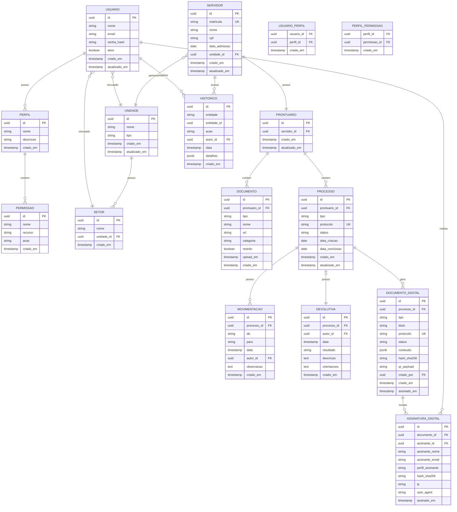

# Servidor 360 — Modelo de Dados

## 1. Objetivo

Este documento define o modelo de dados do Servidor 360, incluindo as entidades, atributos, relacionamentos e o Diagrama Entidade-Relacionamento (DER).

---

## 2. Diagrama Entidade-Relacionamento (DER)



---

## 3. Descrição das Tabelas

### 3.1 USUARIO
Armazena os usuários do sistema.

| Coluna | Tipo | Descrição | Restrições |
|--------|------|-----------|------------|
| id | uuid | Identificador único | PK, NOT NULL |
| nome | string | Nome completo do usuário | NOT NULL |
| email | string | E-mail para autenticação | UNIQUE, NOT NULL |
| senha_hash | string | Hash da senha | NOT NULL |
| ativo | boolean | Indica se o usuário está ativo | NOT NULL, DEFAULT true |
| criado_em | timestamp | Data de criação | NOT NULL, DEFAULT NOW() |
| atualizado_em | timestamp | Data da última atualização | NOT NULL, DEFAULT NOW() |

### 3.2 PERFIL
Define perfis de acesso para usuários.

| Coluna | Tipo | Descrição | Restrições |
|--------|------|-----------|------------|
| id | uuid | Identificador único | PK, NOT NULL |
| nome | string | Nome do perfil | UNIQUE, NOT NULL |
| descricao | string | Descrição do perfil | |
| criado_em | timestamp | Data de criação | NOT NULL, DEFAULT NOW() |

### 3.3 PERMISSAO
Define permissões específicas de acesso.

| Coluna | Tipo | Descrição | Restrições |
|--------|------|-----------|------------|
| id | uuid | Identificador único | PK, NOT NULL |
| nome | string | Nome da permissão | UNIQUE, NOT NULL |
| recurso | string | Recurso ao qual se aplica | NOT NULL |
| acao | string | Ação permitida | NOT NULL |
| criado_em | timestamp | Data de criação | NOT NULL, DEFAULT NOW() |

### 3.4 USUARIO_PERFIL (Tabela de Associação)
Relaciona usuários com perfis (N:N).

| Coluna | Tipo | Descrição | Restrições |
|--------|------|-----------|------------|
| usuario_id | uuid | Referência ao usuário | FK, NOT NULL |
| perfil_id | uuid | Referência ao perfil | FK, NOT NULL |
| criado_em | timestamp | Data de criação | NOT NULL, DEFAULT NOW() |

**Chave Primária:** (usuario_id, perfil_id)

### 3.5 PERFIL_PERMISSAO (Tabela de Associação)
Relaciona perfis com permissões (N:N).

| Coluna | Tipo | Descrição | Restrições |
|--------|------|-----------|------------|
| perfil_id | uuid | Referência ao perfil | FK, NOT NULL |
| permissao_id | uuid | Referência à permissão | FK, NOT NULL |
| criado_em | timestamp | Data de criação | NOT NULL, DEFAULT NOW() |

**Chave Primária:** (perfil_id, permissao_id)

### 3.6 UNIDADE
Armazena as unidades organizacionais.

| Coluna | Tipo | Descrição | Restrições |
|--------|------|-----------|------------|
| id | uuid | Identificador único | PK, NOT NULL |
| nome | string | Nome da unidade | NOT NULL |
| tipo | string | Tipo da unidade | NOT NULL |
| criado_em | timestamp | Data de criação | NOT NULL, DEFAULT NOW() |
| atualizado_em | timestamp | Data da última atualização | NOT NULL, DEFAULT NOW() |

### 3.7 SETOR
Armazena os setores dentro das unidades.

| Coluna | Tipo | Descrição | Restrições |
|--------|------|-----------|------------|
| id | uuid | Identificador único | PK, NOT NULL |
| nome | string | Nome do setor | NOT NULL |
| unidade_id | uuid | Referência à unidade | FK, NOT NULL |
| criado_em | timestamp | Data de criação | NOT NULL, DEFAULT NOW() |

### 3.8 SERVIDOR
Armazena os dados dos servidores públicos.

| Coluna | Tipo | Descrição | Restrições |
|--------|------|-----------|------------|
| id | uuid | Identificador único | PK, NOT NULL |
| matricula | string | Matrícula do servidor | UNIQUE, NOT NULL |
| nome | string | Nome completo | NOT NULL |
| cpf | string | CPF | UNIQUE, NOT NULL |
| data_admissao | date | Data de admissão | NOT NULL |
| unidade_id | uuid | Unidade de lotação | FK, NOT NULL |
| criado_em | timestamp | Data de criação | NOT NULL, DEFAULT NOW() |
| atualizado_em | timestamp | Data da última atualização | NOT NULL, DEFAULT NOW() |

### 3.9 PRONTUARIO
Contém o prontuário funcional de cada servidor.

| Coluna | Tipo | Descrição | Restrições |
|--------|------|-----------|------------|
| id | uuid | Identificador único | PK, NOT NULL |
| servidor_id | uuid | Referência ao servidor | FK, UNIQUE, NOT NULL |
| criado_em | timestamp | Data de criação | NOT NULL, DEFAULT NOW() |
| atualizado_em | timestamp | Data da última atualização | NOT NULL, DEFAULT NOW() |

### 3.10 DOCUMENTO
Armazena os documentos associados ao prontuário.

| Coluna | Tipo | Descrição | Restrições |
|--------|------|-----------|------------|
| id | uuid | Identificador único | PK, NOT NULL |
| prontuario_id | uuid | Referência ao prontuário | FK, NOT NULL |
| tipo | string | Tipo do documento | NOT NULL |
| nome | string | Nome do arquivo | NOT NULL |
| url | string | URL de acesso | NOT NULL |
| categoria | string | Categoria do documento | NOT NULL |
| restrito | boolean | Indica acesso restrito | NOT NULL, DEFAULT false |
| upload_em | timestamp | Data de upload | NOT NULL |
| criado_em | timestamp | Data de criação | NOT NULL, DEFAULT NOW() |

### 3.11 PROCESSO
Armazena os processos funcionais (afastamentos, férias, etc.).

| Coluna | Tipo | Descrição | Restrições |
|--------|------|-----------|------------|
| id | uuid | Identificador único | PK, NOT NULL |
| prontuario_id | uuid | Referência ao prontuário | FK, NOT NULL |
| tipo | string | Tipo do processo | NOT NULL |
| protocolo | string | Número de protocolo | UNIQUE, NOT NULL |
| status | string | Status atual | NOT NULL |
| data_criacao | date | Data de criação | NOT NULL |
| data_conclusao | date | Data de conclusão | |
| criado_em | timestamp | Data de criação | NOT NULL, DEFAULT NOW() |
| atualizado_em | timestamp | Data da última atualização | NOT NULL, DEFAULT NOW() |

### 3.12 MOVIMENTACAO
Registra as tramitações dos processos.

| Coluna | Tipo | Descrição | Restrições |
|--------|------|-----------|------------|
| id | uuid | Identificador único | PK, NOT NULL |
| processo_id | uuid | Referência ao processo | FK, NOT NULL |
| de | string | Origem da movimentação | NOT NULL |
| para | string | Destino da movimentação | NOT NULL |
| data | timestamp | Data da movimentação | NOT NULL |
| autor_id | uuid | Usuário que realizou | FK, NOT NULL |
| observacao | text | Observações | |
| criado_em | timestamp | Data de criação | NOT NULL, DEFAULT NOW() |

### 3.13 DEVOLUTIVA
Armazena as devolutivas formais dos processos.

| Coluna | Tipo | Descrição | Restrições |
|--------|------|-----------|------------|
| id | uuid | Identificador único | PK, NOT NULL |
| processo_id | uuid | Referência ao processo | FK, UNIQUE, NOT NULL |
| autor_id | uuid | Profissional autor | FK, NOT NULL |
| data | timestamp | Data da devolutiva | NOT NULL |
| resultado | string | Resultado da avaliação | NOT NULL |
| descricao | text | Descrição da avaliação | |
| orientacoes | text | Orientações fornecidas | |
| criado_em | timestamp | Data de criação | NOT NULL, DEFAULT NOW() |

### 3.14 HISTORICO
Registra todas as ações relevantes para auditoria.

| Coluna | Tipo | Descrição | Restrições |
|--------|------|-----------|------------|
| id | uuid | Identificador único | PK, NOT NULL |
| entidade | string | Tipo da entidade | NOT NULL |
| entidade_id | uuid | ID da entidade afetada | NOT NULL |
| acao | string | Ação realizada | NOT NULL |
| autor_id | uuid | Usuário que realizou | FK, NOT NULL |
| data | timestamp | Data e hora da ação | NOT NULL |
| detalhes | jsonb | Detalhes adicionais | |
| criado_em | timestamp | Data de criação | NOT NULL, DEFAULT NOW() |

### 3.15 DOCUMENTO_DIGITAL
Armazena versões digitais congeladas e assináveis geradas pelo sistema.

| Coluna | Tipo | Descrição | Restrições |
|--------|------|-----------|------------|
| id | uuid | Identificador único | PK, NOT NULL |
| processo_id | uuid | Referência ao processo/módulo de origem | FK, NOT NULL |
| tipo | string | Tipo do documento digital | NOT NULL |
| titulo | string | Título exibido ao usuário | NOT NULL |
| protocolo | string | Protocolo de validação | UNIQUE, NOT NULL |
| status | string | Situação do documento | NOT NULL |
| conteudo | jsonb | Snapshot do conteúdo assinado | NOT NULL |
| hash_sha256 | string | Hash criptográfico do conteúdo | NOT NULL |
| qr_payload | string | Dados usados no QR Code | NOT NULL |
| criado_por | uuid | Usuário que gerou a versão | FK |
| criado_em | timestamp | Data de criação | NOT NULL, DEFAULT NOW() |
| assinado_em | timestamp | Data da assinatura | |

### 3.16 ASSINATURA_DIGITAL
Registra assinaturas eletrônicas internas vinculadas aos documentos digitais.

| Coluna | Tipo | Descrição | Restrições |
|--------|------|-----------|------------|
| id | uuid | Identificador único | PK, NOT NULL |
| documento_id | uuid | Documento assinado | FK, NOT NULL |
| assinante_id | uuid | Usuário autenticado que assinou | FK, NOT NULL |
| assinante_nome | string | Nome do assinante no momento da assinatura | NOT NULL |
| assinante_email | string | E-mail do assinante | |
| perfil_assinante | string | Perfil utilizado na assinatura | |
| hash_sha256 | string | Hash da versão assinada | NOT NULL |
| ip | string | IP capturado quando disponível | |
| user_agent | string | Navegador/dispositivo informado | |
| assinado_em | timestamp | Data e hora da assinatura | NOT NULL |

---

## 4. Índices Recomendados

### 4.1 Índices de Performance
```sql
-- USUARIO
CREATE INDEX idx_usuario_email ON USUARIO(email);
CREATE INDEX idx_usuario_ativo ON USUARIO(ativo);

-- SERVIDOR
CREATE INDEX idx_servidor_matricula ON SERVIDOR(matricula);
CREATE INDEX idx_servidor_nome ON SERVIDOR(nome);
CREATE INDEX idx_servidor_unidade ON SERVIDOR(unidade_id);

-- PROCESSO
CREATE INDEX idx_processo_protocolo ON PROCESSO(protocolo);
CREATE INDEX idx_processo_status ON PROCESSO(status);
CREATE INDEX idx_processo_tipo ON PROCESSO(tipo);
CREATE INDEX idx_processo_prontuario ON PROCESSO(prontuario_id);

-- DOCUMENTO
CREATE INDEX idx_documento_prontuario ON DOCUMENTO(prontuario_id);
CREATE INDEX idx_documento_categoria ON DOCUMENTO(categoria);
CREATE INDEX idx_documento_restrito ON DOCUMENTO(restrito);

-- DOCUMENTO_DIGITAL
CREATE INDEX idx_documento_digital_processo ON DOCUMENTO_DIGITAL(processo_id);
CREATE INDEX idx_documento_digital_protocolo ON DOCUMENTO_DIGITAL(protocolo);

-- ASSINATURA_DIGITAL
CREATE INDEX idx_assinatura_digital_documento ON ASSINATURA_DIGITAL(documento_id);

-- MOVIMENTACAO
CREATE INDEX idx_movimentacao_processo ON MOVIMENTACAO(processo_id);
CREATE INDEX idx_movimentacao_data ON MOVIMENTACAO(data);

-- HISTORICO
CREATE INDEX idx_historico_entidade ON HISTORICO(entidade, entidade_id);
CREATE INDEX idx_historico_autor ON HISTORICO(autor_id);
CREATE INDEX idx_historico_data ON HISTORICO(data);
```

### 4.2 Índices de Busca
```sql
-- Busca global de servidores
CREATE INDEX idx_servidor_busca ON SERVIDOR USING gin(to_tsvector('portuguese', nome));

-- Busca de documentos
CREATE INDEX idx_documento_busca ON DOCUMENTO USING gin(to_tsvector('portuguese', nome));
```

---

## 5. Relacionamentos e Cardinalidades

| Relacionamento | Cardinalidade | Descrição |
|----------------|---------------|-----------|
| USUARIO ↔ PERFIL | N:N | Um usuário pode ter múltiplos perfis |
| PERFIL ↔ PERMISSAO | N:N | Um perfil contém múltiplas permissões |
| USUARIO ↔ UNIDADE | N:1 | Múltiplos usuários podem estar na mesma unidade |
| USUARIO ↔ SETOR | N:1 | Múltiplos usuários podem estar no mesmo setor |
| UNIDADE ↔ SETOR | 1:N | Uma unidade possui múltiplos setores |
| SERVIDOR ↔ UNIDADE | N:1 | Múltiplos servidores podem estar na mesma unidade |
| SERVIDOR ↔ PRONTUARIO | 1:1 | Cada servidor possui exatamente um prontuário |
| PRONTUARIO ↔ DOCUMENTO | 1:N | Um prontuário contém múltiplos documentos |
| PRONTUARIO ↔ PROCESSO | 1:N | Um prontuário contém múltiplos processos |
| PROCESSO ↔ MOVIMENTACAO | 1:N | Um processo possui múltiplas movimentações |
| PROCESSO ↔ DEVOLUTIVA | 1:0..1 | Um processo pode ter no máximo uma devolutiva |
| PROCESSO ↔ DOCUMENTO_DIGITAL | 1:N | Um processo pode gerar múltiplos documentos digitais |
| DOCUMENTO_DIGITAL ↔ ASSINATURA_DIGITAL | 1:N | Um documento pode receber uma ou mais assinaturas |
| USUARIO ↔ HISTORICO | 1:N | Um usuário registra múltiplos históricos |
| USUARIO ↔ ASSINATURA_DIGITAL | 1:N | Um usuário pode assinar múltiplos documentos |
| SERVIDOR ↔ HISTORICO | 1:N | Um servidor possui múltiplos históricos |

---

## 6. Observações sobre Implementação

### 6.1 Escolha do Banco de Dados
Para o MVP, recomenda-se o uso de **PostgreSQL** devido a:
- Suporte nativo a UUID
- Suporte a JSONB para o campo `detalhes` em HISTORICO
- Suporte a índices de texto completo (gin)
- Confiabilidade e escalabilidade

### 6.2 Armazenamento de Arquivos
- Documentos devem ser armazenados em serviço de storage (ex: S3, MinIO)
- A tabela DOCUMENTO armazena apenas a URL de acesso
- Implementar controle de acesso via signed URLs quando necessário

### 6.3 Campos de Auditoria
- Todas as tabelas principais possuem `criado_em` e `atualizado_em`
- `atualizado_em` deve ser atualizado automaticamente via trigger
- A tabela HISTORICO complementa a auditoria com detalhes específicos

### 6.4 Segurança de Dados
- Campos sensíveis (CPF, senha_hash) devem ter proteção adicional
- Documentos marcados como `restrito = true` exigem permissão específica
- Implementar row-level security (RLS) para controle de acesso por unidade
- Documentos digitais assinados devem ser tratados como imutáveis e corrigidos por nova versão
- Assinaturas eletrônicas internas devem registrar hash, usuário, perfil e data/hora

### 6.5 Performance
- Índices foram definidos para as consultas mais comuns
- Considerar particionamento da tabela HISTORICO por data em produção
- Implementar cache para consultas frequentes (servidores, unidades)
