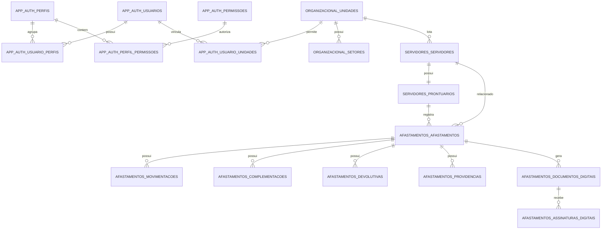

# Servidor 360 — Modelo de Dados

## 1. Objetivo

Este documento descreve o modelo de dados atual do projeto conforme as migrations do Supabase. Ele prioriza a estrutura real usada pelo MVP.

## 2. Organização por Schemas

```mermaid
erDiagram
    APP_AUTH_USUARIOS ||--o{ APP_AUTH_USUARIO_PERFIS : possui
    APP_AUTH_PERFIS ||--o{ APP_AUTH_USUARIO_PERFIS : agrupa
    APP_AUTH_PERFIS ||--o{ APP_AUTH_PERFIL_PERMISSOES : contem
    APP_AUTH_PERMISSOES ||--o{ APP_AUTH_PERFIL_PERMISSOES : autoriza
    APP_AUTH_USUARIOS ||--o{ APP_AUTH_USUARIO_UNIDADES : vincula
    ORGANIZACIONAL_UNIDADES ||--o{ APP_AUTH_USUARIO_UNIDADES : permite
    ORGANIZACIONAL_UNIDADES ||--o{ ORGANIZACIONAL_SETORES : possui
    ORGANIZACIONAL_UNIDADES ||--o{ SERVIDORES_SERVIDORES : lota
    SERVIDORES_SERVIDORES ||--|| SERVIDORES_PRONTUARIOS : possui
    SERVIDORES_PRONTUARIOS ||--o{ AFASTAMENTOS_AFASTAMENTOS : registra
    SERVIDORES_SERVIDORES ||--o{ AFASTAMENTOS_AFASTAMENTOS : relacionado
    AFASTAMENTOS_AFASTAMENTOS ||--o{ AFASTAMENTOS_MOVIMENTACOES : possui
    AFASTAMENTOS_AFASTAMENTOS ||--o{ AFASTAMENTOS_COMPLEMENTACOES : possui
    AFASTAMENTOS_AFASTAMENTOS ||--o{ AFASTAMENTOS_DEVOLUTIVAS : possui
    AFASTAMENTOS_AFASTAMENTOS ||--o{ AFASTAMENTOS_PROVIDENCIAS : possui
    AFASTAMENTOS_AFASTAMENTOS ||--o{ AFASTAMENTOS_DOCUMENTOS_DIGITAIS : gera
    AFASTAMENTOS_DOCUMENTOS_DIGITAIS ||--o{ AFASTAMENTOS_ASSINATURAS_DIGITAIS : recebe
```

## 3. Schema `app_auth`

Responsável por autorização complementar à autenticação nativa do Supabase.

| Tabela | Responsabilidade |
|---|---|
| `usuarios` | Espelho do usuário autenticado, com dados da aplicação. |
| `perfis` | Perfis como `administrador`, `gestor_escolar`, `educacao`, `cas`, `medico`, `rh` e `servidor`. |
| `permissoes` | Permissões no formato recurso/ação, expostas ao frontend como `recurso:acao`. |
| `usuario_perfis` | Associação N:N entre usuários e perfis. |
| `perfil_permissoes` | Associação N:N entre perfis e permissões. |
| `usuario_unidades` | Escopo de unidades permitido para o usuário. |
| `usuario_setores` | Escopo de setores permitido para o usuário. |

Funções internas importantes:

- `app_auth.user_authz_payload(user_id)`
- `app_auth.sync_user_auth_claims(user_id)`
- `app_auth.handle_new_auth_user()`
- `app_auth.handle_auth_user_updated()`
- `app_auth.handle_authz_changed()`

## 4. Schema `organizacional`

| Tabela | Responsabilidade |
|---|---|
| `unidades` | Unidades organizacionais/escolares. |
| `setores` | Setores vinculados às unidades. |

## 5. Schema `servidores`

| Tabela | Responsabilidade |
|---|---|
| `servidores` | Cadastro funcional básico dos servidores, incluindo matrícula, nome, CPF, cargo, unidade e situação. |
| `prontuarios` | Prontuário funcional vinculado a um servidor. |

Observação: o prontuário já existe como estrutura de dados, mas a tela completa de prontuário ainda está pendente no MVP.

## 6. Schema `afastamentos`

| Tabela | Responsabilidade |
|---|---|
| `afastamentos` | Processo principal de afastamento, com servidor, prontuário, status, protocolo, período, motivo e documento de origem. |
| `movimentacoes` | Linha do tempo do processo. |
| `complementacoes` | Solicitações e respostas de complementação. |
| `devolutivas` | Devolutivas emitidas por profissional autorizado. |
| `providencias` | Providências administrativas registradas pelo RH. |
| `documentos_digitais` | Documentos gerados para assinatura interna, com protocolo, hash e payload de QR/protocolo. |
| `assinaturas_digitais` | Assinaturas vinculadas a documentos digitais, com assinante, perfil, hash, data, IP e user agent. |

Status de afastamento usados no frontend:

- `rascunho`
- `registrado`
- `encaminhado`
- `aguardando_analise`
- `em_analise`
- `aguardando_complementacao`
- `aguardando_avaliacao`
- `avaliado`
- `aguardando_rh`
- `concluido`

Status de documento digital:

- `rascunho`
- `aguardando_assinatura`
- `assinado`
- `substituido`
- `cancelado`

## 7. Storage

| Bucket | Uso |
|---|---|
| `afastamentos-documentos` | Documentos de origem e complementações do módulo de afastamentos. |

O bucket é privado, com limite de arquivo e tipos permitidos definidos por migration. O frontend usa URL assinada para visualização temporária.

## 8. RPCs Públicas

As principais funções consumidas pelo frontend são:

| RPC | Responsabilidade |
|---|---|
| `get_current_user_authz()` | Retorna usuário, perfis, permissões, unidades e setores. |
| `current_user_has_permission(permission_name)` | Verifica permissão do usuário autenticado. |
| `current_user_has_unidade(unidade)` | Verifica escopo por unidade. |
| `current_user_is_gestor_escolar()` | Identifica gestor escolar. |
| `current_user_can_access_afastamento(afastamento_uuid)` | Verifica acesso ao processo. |
| `current_user_can_access_ocupacional()` | Verifica acesso a informação ocupacional. |
| `criar_afastamento(input)` | Cria afastamento, prontuário quando necessário, protocolo e movimentação inicial. |
| `registrar_analise_afastamento(...)` | Registra análise e encaminha para próxima etapa. |
| `responder_complementacao_afastamento(...)` | Responde complementação pendente. |
| `emitir_devolutiva_afastamento(...)` | Registra devolutiva e atualiza status. |
| `registrar_providencia_afastamento(...)` | Registra providência e pode concluir o processo. |
| `gerar_documento_digital_afastamento(...)` | Gera documento digital com hash e protocolo. |
| `assinar_documento_digital_afastamento(...)` | Registra assinatura e marca documento como assinado. |
| `validar_documento_digital_afastamento(target_protocolo)` | Valida documento digital por protocolo. |

## 9. Regras de Manutenção

- Novas tabelas de módulo devem ser criadas no schema do módulo.
- `public` deve ser usado preferencialmente para RPCs/fachadas chamadas pelo frontend.
- RPCs sensíveis devem validar permissão e escopo no banco.
- Toda tabela com dado sensível deve ter RLS.
- Novas permissões devem ser refletidas em migrations, constantes do frontend e documentação.
- Alterações de status devem atualizar os tipos TypeScript e este documento.
