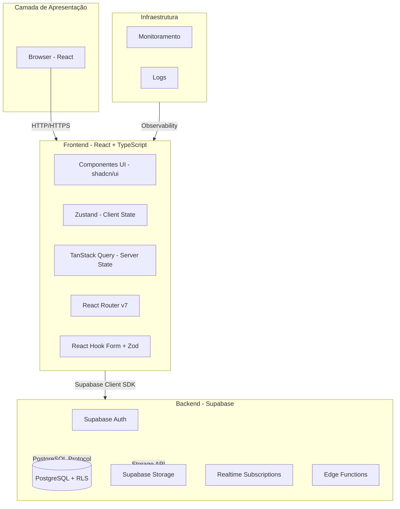

# Servidor 360 — Arquitetura do Sistema

## 1. Objetivo

Este documento define a arquitetura técnica do Servidor 360, descrevendo a organização das camadas, responsabilidades, comunicação entre componentes e decisões arquiteturais. A arquitetura utiliza React no frontend e Supabase como backend-as-a-service.

---

## 2. Visão Geral da Arquitetura



---

## 3. Stack Tecnológica

### 3.1 Frontend

| Camada | Tecnologia | Versão |
|---|---|---|
| Framework | React + TypeScript | React 18+, TS 5+ |
| Build | Vite | 6.x |
| UI / Design System | shadcn/ui + Radix UI | latest |
| Estado global (client) | Zustand + middlewares | 5.x |
| Estado de servidor | TanStack Query | 5.x |
| Formulários | React Hook Form + Zod | RHF 7, Zod 3 |
| Roteamento | React Router v7 | 7.x |
| Testes | Vitest + Testing Library | latest |
| Erros em produção | Sentry | latest |
| Internacionalização | i18next + react-i18next | latest |
| Lint | ESLint + eslint-plugin-boundaries | latest |
| Formatação | Prettier | latest |
| Commits | Husky + Commitlint | latest |

### 3.2 Backend (Supabase)

| Serviço | Descrição |
|---|---|
| **Database** | PostgreSQL com Row-Level Security (RLS) |
| **Auth** | Autenticação pronta (email/password, OAuth, SAML) |
| **Storage** | Armazenamento de arquivos com buckets |
| **Realtime** | Subscriptions em tempo real |
| **Edge Functions** | Funções serverless quando necessário |
| **REST API** | API REST auto-gerada pelo Supabase |

---

## 4. Estrutura de Pastas

```
src/
├── app/
│   ├── providers/          # QueryClientProvider, ThemeProvider, SupabaseProvider
│   ├── routes/             # Definição de rotas (lazy por feature)
│   └── store.ts            # Re-export de stores globais (se necessário)
│
├── shared/
│   ├── components/
│   │   └── ui/             # Componentes shadcn/ui — nunca editar diretamente
│   ├── hooks/              # Hooks reutilizáveis entre features
│   ├── utils/              # Funções puras e helpers
│   ├── lib/                # Instâncias configuradas (queryClient, sentry, i18n, supabase)
│   └── types/              # Tipos globais e compartilhados
│
├── features/
│   ├── auth/
│   ├── users/
│   ├── servidores/
│   ├── afastamentos/
│   └── [feature]/
│       ├── components/     # Componentes internos da feature
│       ├── hooks/          # Hooks locais
│       ├── services/       # Queries e mutations (TanStack Query)
│       ├── store/          # Zustand store da feature
│       ├── types/          # Tipos locais
│       ├── utils/          # Helpers locais
│       ├── i18n/           # Traduções da feature
│       └── index.ts        # API pública — único ponto de exportação
│
├── pages/                  # Orquestração apenas — importa de features
└── main.tsx
```

---

## 5. Regras de Arquitetura

### 5.1 Isolamento de Features (Obrigatório)

- Cada feature é um módulo isolado. Nenhum arquivo interno deve ser importado de fora.
- A única interface pública de uma feature é o seu `index.ts`.
- Features **nunca** importam de outras features diretamente. Se necessário, extrair para `shared/`.
- O `eslint-plugin-boundaries` deve estar configurado para quebrar o build quando esta regra for violada.

```ts
// ERRADO — importação de arquivo interno
import { useAuthStore } from '@/features/auth/store/authStore'

// CORRETO — importação via API pública
import { useAuthStore } from '@/features/auth'
```

### 5.2 Separação de Responsabilidades (Obrigatório)

- **Server state** (dados do Supabase, cache, loading, error) → TanStack Query exclusivamente.
- **Client state** (UI state, preferências, sessão do usuário) → Zustand exclusivamente.
- **Nunca** usar Zustand para armazenar dados que vieram do Supabase.
- **Nunca** usar `useState` para gerenciar dados de servidor.

### 5.3 Regras de UI (Obrigatório)

- Componentes UI ficam em `shared/components/ui/` (shadcn).
- **Nunca** duplicar componentes de UI dentro de features.
- Customizações via composição e CSS variables — nunca editar os arquivos do shadcn diretamente.
- Lógica de negócio **nunca** dentro de componentes de apresentação.

### 5.4 Regra de Ouro: Cada Coisa em um Único Lugar

| O que | Onde SEMPRE vai | Nunca em |
|---|---|---|
| Interface / type | feature/types/ | api/, hooks/, components/, etc. |
| Chamada Supabase | feature/services/ | hooks/, pages/, components/ |
| Regra de negócio | feature/services/ | hooks/, pages/, components/ |
| Hook React | feature/hooks/ | components/, pages/, services/ |
| Componente da feature | feature/components/ | pages/, hooks/, services/ |
| Composição de tela | feature/pages/ | qualquer outro lugar |
| Schema Zod | feature/utils/ ou feature/validations/ | components/, hooks/, services/ |
| Estado Zustand | feature/store/ | components/, hooks/, pages/ |
| Tipo/hook reutilizável | shared/types/ ou shared/hooks/ | dentro de qualquer feature |

---

## 6. Integração com Supabase

### 6.1 Configuração do Cliente Supabase

```ts
// shared/lib/supabase.ts
import { createClient } from '@supabase/supabase-js'
import { env } from './env'

export const supabase = createClient(
  env.VITE_SUPABASE_URL,
  env.VITE_SUPABASE_ANON_KEY,
  {
    auth: {
      autoRefreshToken: true,
      persistSession: true,
      detectSessionInUrl: true,
    },
  }
)
```

### 6.2 Autenticação com Supabase

```ts
// features/auth/services/useAuth.ts
import { useMutation, useQuery, useQueryClient } from '@tanstack/react-query'
import { supabase } from '@/shared/lib/supabase'
import { authKeys } from './authKeys'

export function useLogin() {
  return useMutation({
    mutationFn: async ({ email, password }: LoginDTO) => {
      const { data, error } = await supabase.auth.signInWithPassword({
        email,
        password,
      })
      if (error) throw error
      return data
    },
  })
}

export function useLogout() {
  const queryClient = useQueryClient()
  return useMutation({
    mutationFn: async () => {
      await supabase.auth.signOut()
    },
    onSuccess: () => {
      queryClient.clear()
    },
  })
}

export function useSession() {
  return useQuery({
    queryKey: authKeys.session(),
    queryFn: async () => {
      const { data: { session } } = await supabase.auth.getSession()
      return session
    },
    staleTime: 1000 * 60 * 5, // 5 minutos
  })
}
```

### 6.3 Queries com Supabase + TanStack Query

```ts
// features/servidores/services/useServidores.ts
import { useQuery } from '@tanstack/react-query'
import { supabase } from '@/shared/lib/supabase'
import { servidorKeys } from './servidorKeys'

export function useServidores(filters?: ServidorFilters) {
  return useQuery({
    queryKey: servidorKeys.list(filters),
    queryFn: async () => {
      let query = supabase
        .from('servidores')
        .select('*, unidades(id, nome), perfis(id, nome)')

      if (filters?.search) {
        query = query.ilike('nome', `%${filters.search}%`)
      }

      if (filters?.unidadeId) {
        query = query.eq('unidade_id', filters.unidadeId)
      }

      const { data, error } = await query
      if (error) throw error
      return data
    },
  })
}

export function useServidor(id: string) {
  return useQuery({
    queryKey: servidorKeys.detail(id),
    queryFn: async () => {
      const { data, error } = await supabase
        .from('servidores')
        .select('*, unidades(*), perfis(*)')
        .eq('id', id)
        .single()

      if (error) throw error
      return data
    },
    enabled: Boolean(id),
  })
}
```

### 6.4 Mutations com Supabase

```ts
// features/servidores/services/useCreateServidor.ts
import { useMutation, useQueryClient } from '@tanstack/react-query'
import { supabase } from '@/shared/lib/supabase'
import { servidorKeys } from './servidorKeys'

export function useCreateServidor() {
  const queryClient = useQueryClient()

  return useMutation({
    mutationFn: async (data: CreateServidorDTO) => {
      const { data: result, error } = await supabase
        .from('servidores')
        .insert(data)
        .select()
        .single()

      if (error) throw error
      return result
    },
    onSuccess: () => {
      queryClient.invalidateQueries({ queryKey: servidorKeys.all })
    },
  })
}

export function useUpdateServidor() {
  const queryClient = useQueryClient()

  return useMutation({
    mutationFn: async ({ id, data }: UpdateServidorDTO) => {
      const { data: result, error } = await supabase
        .from('servidores')
        .update(data)
        .eq('id', id)
        .select()
        .single()

      if (error) throw error
      return result
    },
    onSuccess: (_, { id }) => {
      queryClient.invalidateQueries({ queryKey: servidorKeys.all })
      queryClient.invalidateQueries({ queryKey: servidorKeys.detail(id) })
    },
  })
}
```

### 6.5 Realtime Subscriptions

```ts
// features/servidores/hooks/useServidorRealtime.ts
import { useEffect } from 'react'
import { supabase } from '@/shared/lib/supabase'
import { useQueryClient } from '@tanstack/react-query'
import { servidorKeys } from '../services/servidorKeys'

export function useServidorRealtime(id: string) {
  const queryClient = useQueryClient()

  useEffect(() => {
    const channel = supabase
      .channel(`servidor-${id}`)
      .on(
        'postgres_changes',
        {
          event: '*',
          schema: 'public',
          table: 'servidores',
          filter: `id=eq.${id}`,
        },
        (payload) => {
          queryClient.invalidateQueries({ queryKey: servidorKeys.detail(id) })
        }
      )
      .subscribe()

    return () => {
      supabase.removeChannel(channel)
    }
  }, [id, queryClient])
}
```

---

## 7. Row-Level Security (RLS)

### 7.1 Políticas de Acesso

As políticas RLS são definidas diretamente no Supabase e controlam o acesso aos dados no nível de linha:

```sql
-- Exemplo: Política para servidores
-- Apenas usuários com perfil 'administrador' podem ver todos os servidores
CREATE POLICY "Administradores podem ver todos os servidores"
ON servidores FOR SELECT
USING (
  auth.jwt() ->> 'perfis' @> '["administrador"]'::jsonb
);

-- Usuários com perfil 'rh' podem ver servidores da sua unidade
CREATE POLICY "RH pode ver servidores da sua unidade"
ON servidores FOR SELECT
USING (
  auth.jwt() ->> 'perfis' @> '["rh"]'::jsonb
  AND unidade_id IN (
    SELECT unidade_id FROM usuario_unidades
    WHERE usuario_id = auth.uid()
  )
);
```

### 7.2 Custom Claims no JWT

Para implementar RBAC no Supabase, usamos custom claims no JWT:

```ts
// Após login, adicionar perfis ao usuário
const { data: { user } } = await supabase.auth.getUser()

// Atualizar metadata com perfis
await supabase.auth.updateUser({
  data: {
    perfis: ['administrador', 'rh'],
    unidade_id: 'uuid-da-unidade',
  },
})
```

---

## 8. Storage de Arquivos

### 8.1 Upload de Arquivos

```ts
// features/servidores/services/useUploadDocumento.ts
import { useMutation } from '@tanstack/react-query'
import { supabase } from '@/shared/lib/supabase'

export function useUploadDocumento() {
  return useMutation({
    mutationFn: async ({ file, path }: UploadDTO) => {
      const { data, error } = await supabase.storage
        .from('documentos')
        .upload(path, file)

      if (error) throw error
      return data
    },
  })
}
```

### 8.2 Download de Arquivos

```ts
export function useGetDocumentoUrl(path: string) {
  return useQuery({
    queryKey: ['documento-url', path],
    queryFn: async () => {
      const { data, error } = await supabase.storage
        .from('documentos')
        .createSignedUrl(path, 3600) // 1 hora

      if (error) throw error
      return data.signedUrl
    },
    enabled: Boolean(path),
  })
}
```

---

## 9. Estado Global (Zustand)

### 9.1 Padrão Obrigatório

Todo store Zustand deve seguir este padrão com os três middlewares:

```ts
// features/[feature]/store/[feature]Store.ts
import { create } from 'zustand'
import { devtools, persist } from 'zustand/middleware'
import { immer } from 'zustand/middleware/immer'

interface ExampleState {
  // dados
  selectedId: string | null
  filters: Filters

  // ações
  setSelectedId: (id: string) => void
  setFilters: (filters: Filters) => void
  reset: () => void
}

const initialState = {
  selectedId: null,
  filters: {},
}

export const useExampleStore = create<ExampleState>()(
  devtools(
    persist(
      (set) => ({
        ...initialState,

        setSelectedId: (id) =>
          set({ selectedId: id }, false, 'example/setSelectedId'),

        setFilters: (filters) =>
          set({ filters }, false, 'example/setFilters'),

        reset: () =>
          set(initialState, false, 'example/reset'),
      }),
      {
        name: 'example-store',
        partialize: (state) => ({
          selectedId: state.selectedId,
          filters: state.filters,
        }),
      }
    ),
    { name: 'ExampleStore' }
  )
)
```

### 9.2 Regras do Zustand

- `devtools` sempre presente em todos os stores.
- O terceiro argumento do `set` (`'feature/actionName'`) é obrigatório.
- `persist` apenas quando o dado precisa sobreviver ao reload.
- `partialize` obrigatório quando usar `persist`.
- `immer` apenas quando o estado tiver objetos/arrays aninhados.
- Um store por feature — nunca um store global gigante.
- Sem lógica assíncrona dentro da store — para isso existe o TanStack Query.

---

## 10. Formulários (React Hook Form + Zod)

### 10.1 Schema Zod

```ts
// features/servidores/utils/servidorSchema.ts
import { z } from 'zod'

export const servidorSchema = z.object({
  nome: z.string().min(3, 'Nome deve ter no mínimo 3 caracteres'),
  cpf: z.string().length(11, 'CPF deve ter 11 dígitos'),
  email: z.string().email('E-mail inválido'),
  unidade_id: z.string().uuid('Unidade inválida'),
  perfil_id: z.string().uuid('Perfil inválido'),
})

export type ServidorDTO = z.infer<typeof servidorSchema>
```

### 10.2 Componente de Formulário

```tsx
// features/servidores/components/ServidorForm.tsx
import { useForm } from 'react-hook-form'
import { zodResolver } from '@hookform/resolvers/zod'
import { servidorSchema, type ServidorDTO } from '../utils/servidorSchema'
import { useCreateServidor } from '../services/useCreateServidor'

export function ServidorForm() {
  const { register, handleSubmit, formState: { errors } } = useForm<ServidorDTO>({
    resolver: zodResolver(servidorSchema),
  })

  const { mutate: createServidor, isPending } = useCreateServidor()

  return (
    <form onSubmit={handleSubmit((data) => createServidor(data))}>
      {/* ... */}
    </form>
  )
}
```

---

## 11. Query Keys (Factory Obrigatória)

```ts
// features/[feature]/services/[entity]Keys.ts
export const [entity]Keys = {
  all: ['[entity]'] as const,
  lists: () => [...[entity]Keys.all, 'list'] as const,
  list: (filters: FilterType) => [...[entity]Keys.lists(), filters] as const,
  details: () => [...[entity]Keys.all, 'detail'] as const,
  detail: (id: string) => [...[entity]Keys.details(), id] as const,
}
```

---

## 12. Variáveis de Ambiente (Validação Obrigatória)

```ts
// shared/lib/env.ts
import { z } from 'zod'

const envSchema = z.object({
  VITE_SUPABASE_URL: z.string().url(),
  VITE_SUPABASE_ANON_KEY: z.string().min(1),
  VITE_SENTRY_DSN: z.string().min(1),
  VITE_APP_ENV: z.enum(['development', 'staging', 'production']),
})

export const env = envSchema.parse({
  VITE_SUPABASE_URL: import.meta.env.VITE_SUPABASE_URL,
  VITE_SUPABASE_ANON_KEY: import.meta.env.VITE_SUPABASE_ANON_KEY,
  VITE_SENTRY_DSN: import.meta.env.VITE_SENTRY_DSN,
  VITE_APP_ENV: import.meta.env.VITE_APP_ENV,
})
```

---

## 13. Rotas (Lazy Loading Obrigatório)

```tsx
// app/routes/index.tsx
import { lazy, Suspense } from 'react'
import { createBrowserRouter } from 'react-router-dom'

const LoginPage = lazy(() => import('@/pages/LoginPage'))
const DashboardPage = lazy(() => import('@/pages/DashboardPage'))
const ServidoresPage = lazy(() => import('@/pages/ServidoresPage'))

export const router = createBrowserRouter([
  {
    path: '/login',
    element: (
      <Suspense fallback={<PageSkeleton />}>
        <LoginPage />
      </Suspense>
    ),
  },
  {
    path: '/dashboard',
    element: (
      <ProtectedRoute>
        <Suspense fallback={<PageSkeleton />}>
          <DashboardPage />
        </Suspense>
      </ProtectedRoute>
    ),
  },
  {
    path: '/servidores',
    element: (
      <ProtectedRoute>
        <Suspense fallback={<PageSkeleton />}>
          <ServidoresPage />
        </Suspense>
      </ProtectedRoute>
    ),
  },
])
```

---

## 14. Permissões e RBAC

```tsx
// shared/hooks/usePermission.ts
export function usePermission(permission: Permission) {
  const { user } = useAuthStore()
  return user?.perfis?.includes(permission) ?? false
}

// shared/components/Can.tsx
export function Can({ permission, children, fallback = null }: CanProps) {
  const allowed = usePermission(permission)
  return allowed ? <>{children}</> : <>{fallback}</>
}

// uso em componente
<Can permission="administrador" fallback={<ReadOnlyView />}>
  <EditServidorForm />
</Can>
```

---

## 15. Tema e Variáveis CSS (Regra Global)

Todo valor visual do projeto deve ser definido via variáveis CSS e tokens Tailwind:

```css
/* src/app/styles/globals.css */
:root {
  --color-primary: #3b82f6;
  --color-primary-hover: #2563eb;
  --color-secondary: #8b5cf6;
  --color-background: #ffffff;
  --color-surface: #f8fafc;
  --color-border: #e2e8f0;
  --color-text: #0f172a;
  --color-text-muted: #64748b;
  --color-error: #ef4444;
  --color-success: #22c55e;
  --color-warning: #f59e0b;

  --font-sans: "Inter", sans-serif;
  --font-mono: "JetBrains Mono", monospace;

  --radius-sm: 0.25rem;
  --radius-md: 0.5rem;
  --radius-lg: 0.75rem;
  --radius-full: 9999px;

  --shadow-sm: 0 1px 2px rgba(0,0,0,0.05);
  --shadow-md: 0 4px 6px rgba(0,0,0,0.07);
  --shadow-lg: 0 10px 15px rgba(0,0,0,0.10);
}
```

```ts
// tailwind.config.ts
export default {
  theme: {
    extend: {
      colors: {
        primary: "var(--color-primary)",
        secondary: "var(--color-secondary)",
        background: "var(--color-background)",
        surface: "var(--color-surface)",
        border: "var(--color-border)",
        text: "var(--color-text)",
        muted: "var(--color-text-muted)",
        error: "var(--color-error)",
        success: "var(--color-success)",
        warning: "var(--color-warning)",
      },
      fontFamily: {
        sans: "var(--font-sans)",
        mono: "var(--font-mono)",
      },
      borderRadius: {
        sm: "var(--radius-sm)",
        md: "var(--radius-md)",
        lg: "var(--radius-lg)",
        full: "var(--radius-full)",
      },
      boxShadow: {
        sm: "var(--shadow-sm)",
        md: "var(--shadow-md)",
        lg: "var(--shadow-lg)",
      },
    },
  },
};
```

---

## 16. Comunicação Entre Camadas

### 16.1 Frontend ↔ Supabase

**Protocolo:** HTTPS via Supabase Client SDK

**Autenticação:**
- Supabase Auth gerencia sessões automaticamente
- JWT tokens armazenados e renovados automaticamente
- Session persistida via localStorage

**Formato de Resposta:**
- TanStack Query normaliza as respostas do Supabase
- Erros são tratados pelo middleware de erro do TanStack Query

### 16.2 Tratamento de Erros

```ts
// shared/lib/queryClient.ts
import { QueryClient } from '@tanstack/react-query'
import * as Sentry from '@sentry/react'

export const queryClient = new QueryClient({
  defaultOptions: {
    queries: {
      staleTime: 1000 * 60 * 5,       // 5 minutos
      gcTime: 1000 * 60 * 10,          // 10 minutos
      retry: (failureCount, error) => {
        if (error instanceof SupabaseError && error.status < 500) return false
        return failureCount < 2
      },
      refetchOnWindowFocus: false,
    },
    mutations: {
      onError: (error) => {
        Sentry.captureException(error)
      },
    },
  },
})
```

---

## 17. Segurança

### 17.1 Autenticação

**Fluxo:**
1. Usuário envia credenciais para Supabase Auth
2. Supabase valida e retorna session + JWT
3. Session é armazenada automaticamente pelo cliente
4. JWT é incluído automaticamente em todas as requisições
5. Supabase renova tokens automaticamente

### 17.2 Autorização

**Implementação:**
- Row-Level Security (RLS) no Supabase
- Custom claims no JWT com perfis e permissões
- Verificação de permissões no frontend (UI) e backend (RLS)
- Políticas RLS por tabela e operação

### 17.3 Proteção de Dados

**Em Trânsito:**
- TLS 1.3 para todas as conexões (Supabase)

**Em Repouso:**
- Supabase criptografa dados automaticamente
- Criptografia de campos sensíveis via PostgreSQL

**Na Aplicação:**
- Sanitização de inputs (Zod)
- SQL injection prevention (Supabase RLS + prepared statements)
- XSS prevention (React sanitiza por padrão)

### 17.4 Auditoria

**Implementação:**
- Triggers no PostgreSQL para registrar alterações
- Tabela HISTORICO para auditoria
- Logs do Supabase Dashboard
- Sentry para error tracking

---

## 18. Performance e Escalabilidade

### 18.1 Estratégias de Cache

**Client-side:**
- TanStack Query com stale-time configurado
- Cache local no navegador

**Server-side:**
- Supabase cache automático
- Edge caching via CDN

### 18.2 Otimizações de Banco de Dados

- Índices apropriados no PostgreSQL
- Query optimization via Supabase Dashboard
- Connection pooling (Supabase gerencia)

### 18.3 Lazy Loading

- Code splitting por rota (React Router lazy)
- Lazy loading de componentes pesados
- Virtual scrolling para listas longas
- Paginação em todas as listas

---

## 19. Monitoramento e Observabilidade

### 19.1 Error Tracking

**Sentry Integration:**
```ts
// shared/lib/sentry.ts
import * as Sentry from '@sentry/react'
import { env } from './env'

Sentry.init({
  dsn: env.VITE_SENTRY_DSN,
  environment: env.VITE_APP_ENV,
  enabled: env.VITE_APP_ENV !== 'development',
  tracesSampleRate: env.VITE_APP_ENV === 'production' ? 0.2 : 1.0,
  integrations: [
    Sentry.reactRouterV7BrowserTracingIntegration({ useEffect }),
  ],
})
```

### 19.2 Logs

- Supabase Dashboard logs
- Sentry para erros e performance
- Console logs em desenvolvimento

---

## 20. Decisões Arquiteturais

### 20.1 Supabase vs Backend Custom

**Decisão:** Supabase como backend-as-a-service

**Justificativa:**
- Autenticação pronta e segura
- PostgreSQL com RLS embutido
- Storage integrado
- Realtime subscriptions
- Menor código a manter
- Escalabilidade automática
- Edge Functions quando necessário

### 20.2 Client-Side Rendering vs Server-Side Rendering

**Decisão:** Client-Side Rendering (CSR)

**Justificativa:**
- Stack React com Vite otimizado para CSR
- Melhor experiência interativa
- TanStack Query gerencia o server state
- Supabase Client SDK otimizado para CSR
- Pode evoluir para Next.js no futuro

### 20.3 Monolith vs Microservices

**Decisão:** Monolith (Supabase + React)

**Justificativa:**
- Supabase gerencia a infraestrutura
- Simplicidade de desenvolvimento
- Menor overhead operacional
- Pode evoluir para Edge Functions se necessário

---

## 21. Deployment

### 21.1 Ambientes

- **Development:** Local com Supabase local
- **Staging:** Projeto Supabase de staging
- **Production:** Projeto Supabase de produção

### 21.2 Estratégia de Deploy

**Frontend:**
- Build estático com Vite
- Deploy em Vercel, Netlify, ou similar
- CI/CD via GitHub Actions

**Backend (Supabase):**
- Migrations via Supabase CLI
- Edge Functions via Supabase CLI
- RLS policies via Supabase Dashboard ou CLI

### 21.3 CI/CD Pipeline

**Stages:**
1. **Lint & Type Check:** ESLint, TypeScript
2. **Tests:** Unit tests, integration tests
3. **Build:** Frontend build
4. **Supabase Migrations:** Apply migrations
5. **Deploy Staging:** Deploy automático para staging
6. **E2E Tests:** Testes end-to-end em staging
7. **Deploy Production:** Deploy manual ou automático

---

## 22. Roadmap de Evolução

### Fase 1 (MVP)
- React + Supabase (Auth, Database, Storage)
- Autenticação com email/password
- Módulo de afastamentos
- Prontuário funcional básico

### Fase 2
- Autenticação com OAuth (Google, Microsoft)
- Módulo de férias
- Melhorias no prontuário
- Dashboard gerencial
- Realtime subscriptions

### Fase 3
- Módulo de capacitações
- Módulo de avaliações
- Edge Functions para lógica complexa
- Integração com sistemas legados

### Fase 4 (Futuro)
- Avaliação de Next.js para SSR
- Mobile app (React Native)
- Machine learning para previsões
- Advanced analytics

---

## 23. Conclusão

Esta arquitetura foi projetada para:

- **Simplicidade:** Supabase elimina a necessidade de backend custom
- **Escalabilidade:** Supabase escala automaticamente
- **Manutenibilidade:** Código organizado e documentado
- **Segurança:** RLS + Auth do Supabase
- **Performance:** TanStack Query + Supabase otimizações
- **Desenvolvimento Rápido:** Menos código, mais funcionalidade

O MVP foca em funcionalidades essenciais com uma arquitetura sólida que permite evolução gradual sem refactoring massivo.
