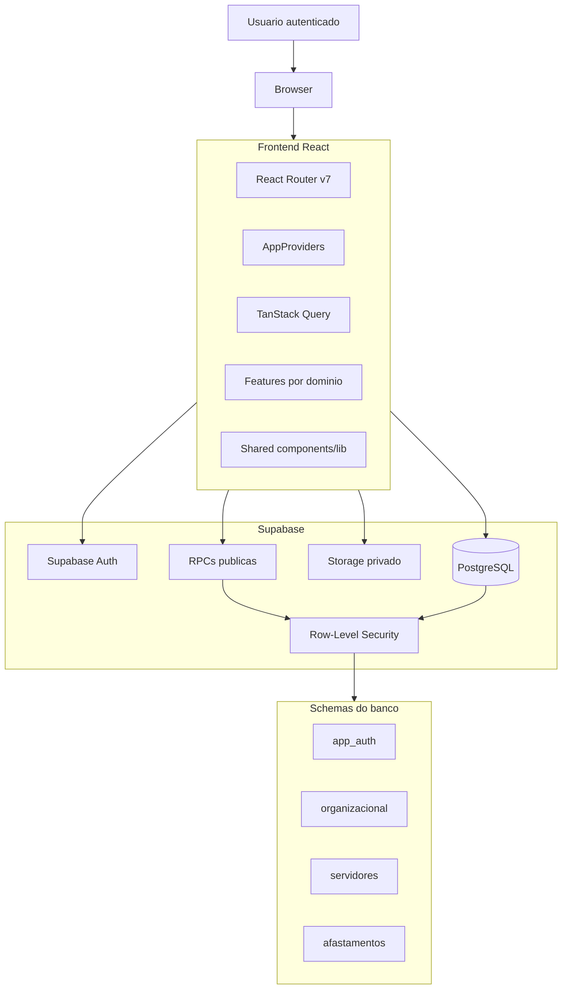

# Servidor 360 — Arquitetura do Sistema

## 1. Objetivo

Este documento descreve a arquitetura técnica atual do Servidor 360. Ele deve ser mantido alinhado ao código, às migrations do Supabase e ao checklist de status do projeto.

## 2. Visão Geral


```mermaid
flowchart TB
    Usuario[Usuario autenticado] --> Browser[Browser]

    subgraph Frontend["Frontend React"]
        Rotas[React Router v7]
        Providers[AppProviders]
        Query[TanStack Query]
        Features[Features por dominio]
        Shared[Shared components/lib]
    end

    subgraph Supabase["Supabase"]
        Auth[Supabase Auth]
        RPC[RPCs publicas]
        Storage[Storage privado]
        RLS[Row-Level Security]
        DB[(PostgreSQL)]
    end

    subgraph Schemas["Schemas do banco"]
        AppAuth[app_auth]
        Organizacional[organizacional]
        Servidores[servidores]
        Afastamentos[afastamentos]
    end

    Browser --> Frontend
    Frontend --> Auth
    Frontend --> RPC
    Frontend --> Storage
    Frontend --> DB
    RPC --> RLS
    DB --> RLS
    RLS --> Schemas
```

## 3. Stack Atual

| Camada | Tecnologia |
|---|---|
| Frontend | React 19 + TypeScript 6 |
| Build | Vite 8 |
| Rotas | React Router v7 |
| Estado de servidor | TanStack Query |
| Formulários | React Hook Form + Zod |
| Backend | Supabase Auth, PostgreSQL, RPC, RLS e Storage |
| UI | Tailwind CSS e componentes compartilhados |
| Lint | ESLint |

## 4. Estrutura de Pastas

```text
src/
├── app/
│   ├── providers/          # Providers globais
│   └── routes/             # Rotas lazy e protegidas
├── features/
│   ├── auth/               # Login, sessão, permissões e guards
│   └── afastamentos/       # Fluxo do módulo de afastamentos
├── pages/                  # Composição de páginas roteáveis
├── shared/
│   ├── components/         # Layout e UI compartilhada
│   └── lib/                # Supabase, env e queryClient
├── main.tsx
└── index.css
```

## 5. Regras de Organização

- Cada domínio de negócio deve ficar em `src/features/<modulo>`.
- A API pública de uma feature deve ser exposta por `index.ts`.
- Páginas em `src/pages` devem orquestrar telas e importar preferencialmente pela API pública da feature.
- Chamadas ao Supabase devem ficar em `services`.
- Hooks de consulta/mutation devem ficar em `hooks`.
- Tipos do domínio devem ficar em `types`.
- Componentes reutilizáveis entre módulos devem ir para `shared`.
- Rotas novas devem usar lazy loading e, quando necessário, `ProtectedRoute`.

## 6. Comunicação Frontend x Supabase

O frontend usa duas formas principais de acesso:

- **Leitura direta com RLS:** listagens e detalhes que podem ser protegidos por políticas.
- **RPC pública:** ações transacionais ou sensíveis, como criar afastamento, registrar análise, emitir devolutiva, assinar documento e validar protocolo.

RPCs públicas funcionam como fachada estável para o frontend. A lógica sensível fica no banco e valida permissões novamente no servidor.

## 7. Organização dos Schemas

| Schema | Responsabilidade |
|---|---|
| `app_auth` | Usuários da aplicação, perfis, permissões e vínculos de autorização. |
| `organizacional` | Unidades e setores. |
| `servidores` | Cadastro de servidores e prontuários. |
| `afastamentos` | Processos de afastamento, movimentações, complementações, devolutivas, providências, documentos digitais e assinaturas. |
| `public` | Funções RPC/fachadas consumidas pelo frontend e helpers de autorização. |

Novas tabelas de módulo não devem ser criadas em `public`. Use `public` para funções de fachada quando o frontend precisar chamar via Supabase Client.

## 8. Autorização

A autorização combina:

- sessão do Supabase Auth;
- payload de autorização retornado por `get_current_user_authz()`;
- permissões verificadas no frontend para navegação e renderização;
- funções de autorização no banco;
- RLS nas tabelas;
- validação dentro das RPCs.

O frontend não é fonte de verdade para autorização. Qualquer ação sensível deve ser validada também no Supabase.

## 9. Módulo de Afastamentos

O módulo de afastamentos é o módulo mais avançado do MVP. Ele possui:

- criação de processo;
- protocolo;
- upload de documento de origem;
- análise;
- complementação;
- devolutiva;
- providência administrativa;
- conclusão;
- movimentações;
- cofre de documentos digitais;
- assinatura eletrônica interna;
- validação por protocolo.

Consulte o checklist detalhado em [Status e Checklists](../01-status/README.md).

## 10. Critérios para Evoluir a Arquitetura

Ao criar uma nova funcionalidade, verifique:

- se ela pertence ao núcleo global ou a um módulo;
- se precisa de nova permissão;
- se precisa de nova tabela, RPC ou política RLS;
- se afeta requisitos ou casos de uso;
- se o checklist do módulo precisa ser atualizado;
- se há testes ou validação manual obrigatória.
