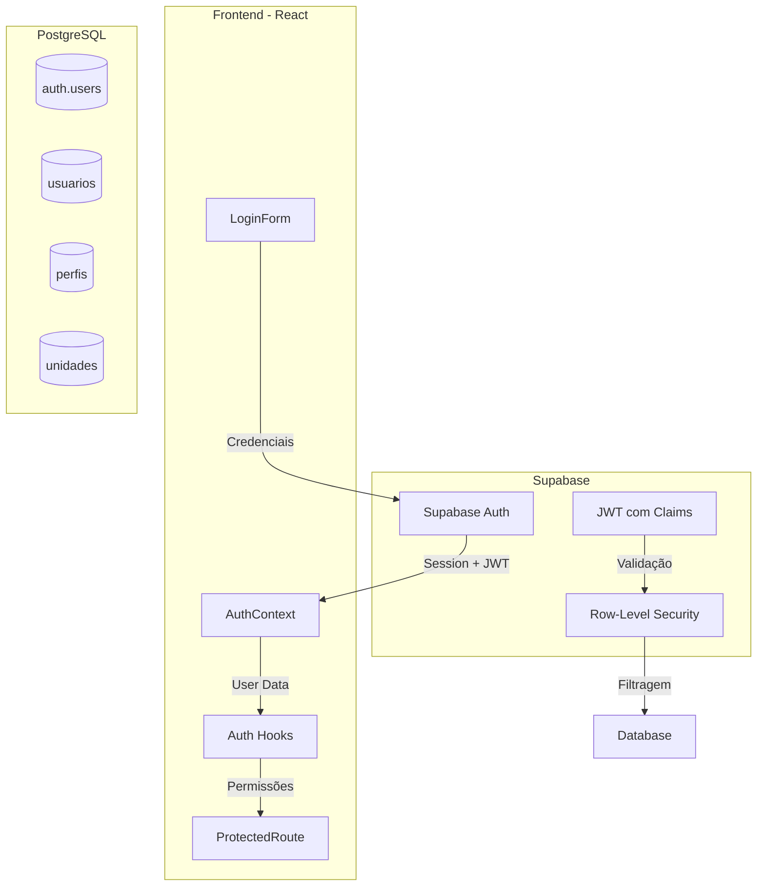
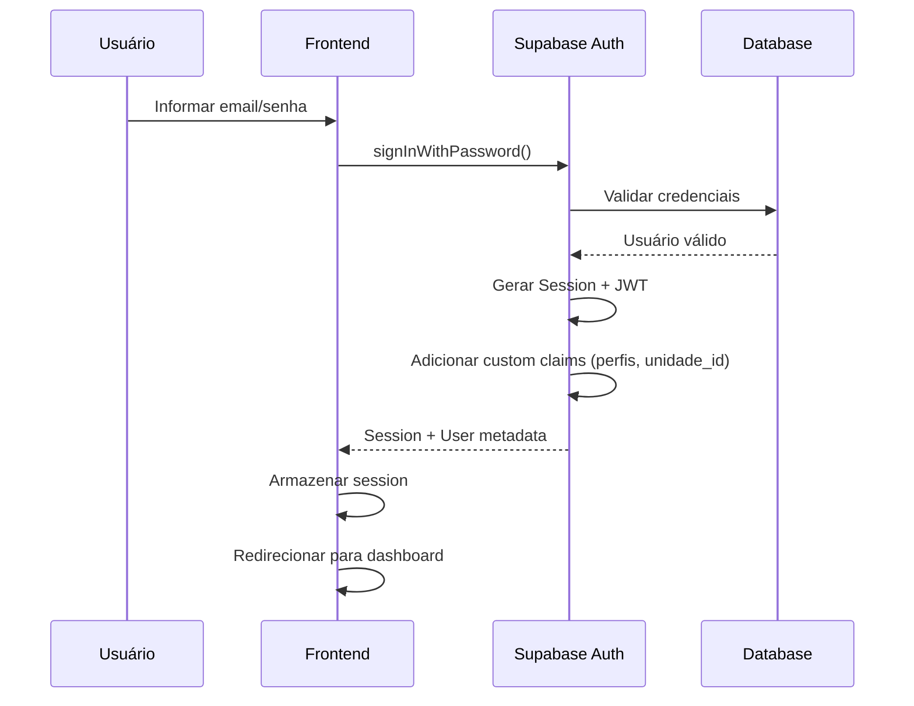
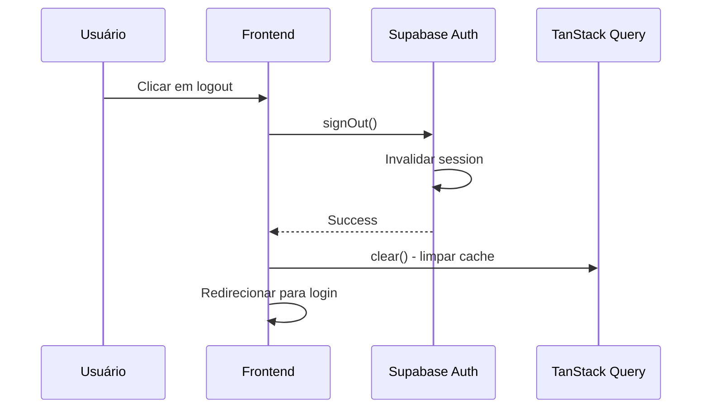
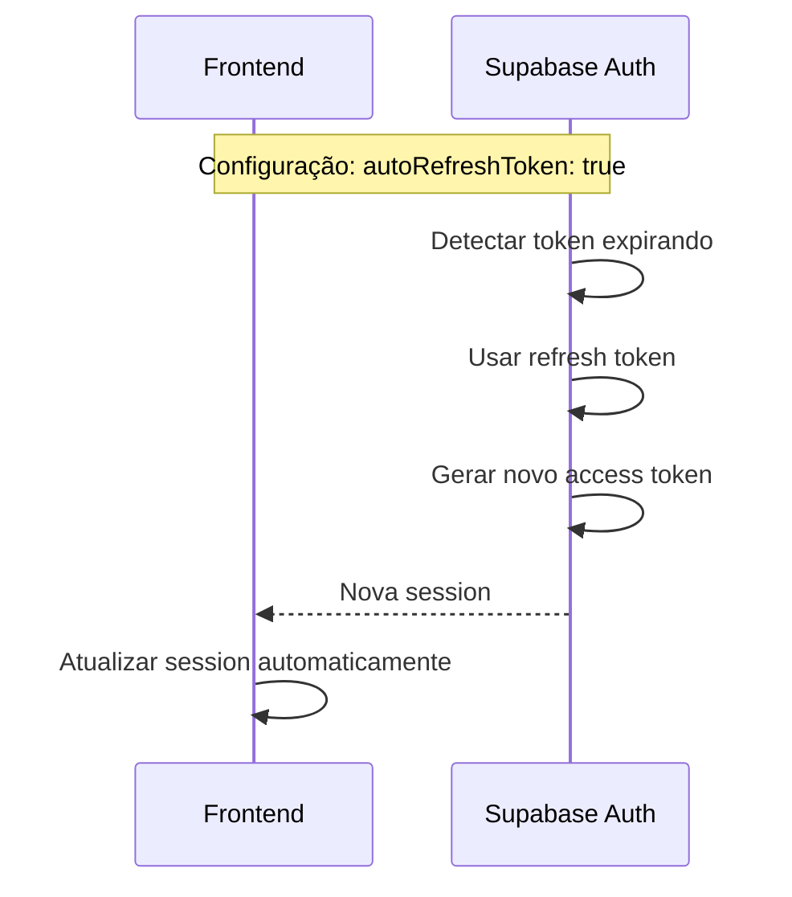

# Servidor 360 — Autenticação e Autorização

## 1. Visão Geral

Este documento define como a autenticação e autorização funcionam no Servidor 360, utilizando Supabase Auth e Row-Level Security (RLS) para controlar o acesso aos dados.

---

## 2. Arquitetura de Autenticação



---

## 3. Fluxo de Autenticação

### 3.1 Login



### 3.2 Logout



### 3.3 Refresh Token



---

## 4. Estrutura de Tabelas de Autenticação

### 4.1 Tabela `usuarios` (Custom)

```sql
CREATE TABLE public.usuarios (
  id UUID PRIMARY KEY REFERENCES auth.users(id) ON DELETE CASCADE,
  email TEXT NOT NULL UNIQUE,
  nome_completo TEXT NOT NULL,
  cpf TEXT UNIQUE,
  ativo BOOLEAN DEFAULT true,
  created_at TIMESTAMPTZ DEFAULT NOW(),
  updated_at TIMESTAMPTZ DEFAULT NOW()
);

-- Índices
CREATE INDEX idx_usuarios_email ON public.usuarios(email);
CREATE INDEX idx_usuarios_cpf ON public.usuarios(cpf);
CREATE INDEX idx_usuarios_ativo ON public.usuarios(ativo);
```

### 4.2 Tabela `perfis`

```sql
CREATE TABLE public.perfis (
  id UUID PRIMARY KEY DEFAULT gen_random_uuid(),
  nome TEXT NOT NULL UNIQUE,
  descricao TEXT,
  permissoes JSONB DEFAULT '[]'::jsonb,
  created_at TIMESTAMPTZ DEFAULT NOW(),
  updated_at TIMESTAMPTZ DEFAULT NOW()
);

-- Perfis iniciais
INSERT INTO public.perfis (nome, descricao, permissoes) VALUES
('administrador', 'Acesso total ao sistema', '["*"]'::jsonb),
('rh', 'Gestão de RH e servidores', '["servidores:read", "servidores:write", "afastamentos:read", "afastamentos:write"]'::jsonb),
('medico', 'Acesso a prontuário médico', '["prontuario:read", "prontuario:write"]'::jsonb),
('enfermeiro', 'Acesso básico ao prontuário', '["prontuario:read"]'::jsonb),
('cas', 'Controle e Avaliação Social', '["cas:read", "cas:write"]'::jsonb);
```

### 4.3 Tabela `usuario_perfis` (Many-to-Many)

```sql
CREATE TABLE public.usuario_perfis (
  id UUID PRIMARY KEY DEFAULT gen_random_uuid(),
  usuario_id UUID NOT NULL REFERENCES public.usuarios(id) ON DELETE CASCADE,
  perfil_id UUID NOT NULL REFERENCES public.perfis(id) ON DELETE CASCADE,
  created_at TIMESTAMPTZ DEFAULT NOW(),
  UNIQUE(usuario_id, perfil_id)
);

-- Índices
CREATE INDEX idx_usuario_perfis_usuario ON public.usuario_perfis(usuario_id);
CREATE INDEX idx_usuario_perfis_perfil ON public.usuario_perfis(perfil_id);
```

### 4.4 Tabela `usuario_unidades` (Multi-unidade)

```sql
CREATE TABLE public.usuario_unidades (
  id UUID PRIMARY KEY DEFAULT gen_random_uuid(),
  usuario_id UUID NOT NULL REFERENCES public.usuarios(id) ON DELETE CASCADE,
  unidade_id UUID NOT NULL REFERENCES public.unidades(id) ON DELETE CASCADE,
  created_at TIMESTAMPTZ DEFAULT NOW(),
  UNIQUE(usuario_id, unidade_id)
);

-- Índices
CREATE INDEX idx_usuario_unidades_usuario ON public.usuario_unidades(usuario_id);
CREATE INDEX idx_usuario_unidades_unidade ON public.usuario_unidades(unidade_id);
```

---

## 5. Custom Claims no JWT

### 5.1 Trigger para Adicionar Claims

```sql
-- Trigger para adicionar custom claims ao JWT
CREATE OR REPLACE FUNCTION public.add_user_claims()
RETURNS TRIGGER AS $$
DECLARE
  user_perfis JSONB;
  user_unidades JSONB;
BEGIN
  -- Buscar perfis do usuário
  SELECT jsonb_agg(p.nome) INTO user_perfis
  FROM public.usuario_perfis up
  JOIN public.perfis p ON up.perfil_id = p.id
  WHERE up.usuario_id = NEW.id;

  -- Buscar unidades do usuário
  SELECT jsonb_agg(u.unidade_id) INTO user_unidades
  FROM public.usuario_unidades u
  WHERE u.usuario_id = NEW.id;

  -- Adicionar claims ao metadata
  NEW.raw_user_meta_data = COALESCE(NEW.raw_user_meta_data, '{}'::jsonb);
  NEW.raw_user_meta_data = NEW.raw_user_meta_data || jsonb_build_object(
    'perfis', COALESCE(user_perfis, '[]'::jsonb),
    'unidades', COALESCE(user_unidades, '[]'::jsonb)
  );

  RETURN NEW;
END;
$$ LANGUAGE plpgsql SECURITY DEFINER;

-- Trigger no auth.users
CREATE TRIGGER on_auth_user_created
AFTER INSERT ON auth.users
FOR EACH ROW EXECUTE FUNCTION public.add_user_claims();

-- Trigger para atualizar claims quando perfis mudam
CREATE TRIGGER on_usuario_perfis_change
AFTER INSERT OR UPDATE OR DELETE ON public.usuario_perfis
FOR EACH ROW EXECUTE FUNCTION public.update_user_claims();
```

### 5.2 Função para Atualizar Claims

```sql
CREATE OR REPLACE FUNCTION public.update_user_claims()
RETURNS TRIGGER AS $$
BEGIN
  UPDATE auth.users
  SET raw_user_meta_data = (
    SELECT jsonb_build_object(
      'perfis', jsonb_agg(p.nome),
      'unidades', jsonb_agg(uu.unidade_id)
    )
    FROM public.usuario_perfis up
    JOIN public.perfis p ON up.perfil_id = p.id
    LEFT JOIN public.usuario_unidades uu ON uu.usuario_id = up.usuario_id
    WHERE up.usuario_id = COALESCE(NEW.usuario_id, OLD.usuario_id)
  )
  WHERE id = COALESCE(NEW.usuario_id, OLD.usuario_id);

  RETURN COALESCE(NEW, OLD);
END;
$$ LANGUAGE plpgsql SECURITY DEFINER;
```

---

## 6. Row-Level Security (RLS)

### 6.1 Habilitar RLS

```sql
-- Habilitar RLS nas tabelas principais
ALTER TABLE public.usuarios ENABLE ROW LEVEL SECURITY;
ALTER TABLE public.servidores ENABLE ROW LEVEL SECURITY;
ALTER TABLE public.afastamentos ENABLE ROW LEVEL SECURITY;
ALTER TABLE public.prontuarios ENABLE ROW LEVEL SECURITY;
```

### 6.2 Políticas para `usuarios`

```sql
-- Política: Administradores podem ver todos os usuários
CREATE POLICY "Administradores podem ver todos os usuários"
ON public.usuarios FOR SELECT
USING (
  auth.jwt() ->> 'perfis' @> '["administrador"]'::jsonb
);

-- Política: Usuários podem ver seus próprios dados
CREATE POLICY "Usuários podem ver seus próprios dados"
ON public.usuarios FOR SELECT
USING (id = auth.uid());

-- Política: Administradores podem atualizar usuários
CREATE POLICY "Administradores podem atualizar usuários"
ON public.usuarios FOR UPDATE
USING (
  auth.jwt() ->> 'perfis' @> '["administrador"]'::jsonb
);

-- Política: Usuários podem atualizar seus próprios dados
CREATE POLICY "Usuários podem atualizar seus próprios dados"
ON public.usuarios FOR UPDATE
USING (id = auth.uid());
```

### 6.3 Políticas para `servidores`

```sql
-- Política: Administradores podem ver todos os servidores
CREATE POLICY "Administradores podem ver todos os servidores"
ON public.servidores FOR SELECT
USING (
  auth.jwt() ->> 'perfis' @> '["administrador"]'::jsonb
);

-- Política: RH pode ver servidores da sua unidade
CREATE POLICY "RH pode ver servidores da sua unidade"
ON public.servidores FOR SELECT
USING (
  auth.jwt() ->> 'perfis' @> '["rh"]'::jsonb
  AND unidade_id = ANY(
    SELECT (auth.jwt() ->> 'unidades')::jsonb ->> 0::text
  )
);

-- Política: Administradores podem criar servidores
CREATE POLICY "Administradores podem criar servidores"
ON public.servidores FOR INSERT
WITH CHECK (
  auth.jwt() ->> 'perfis' @> '["administrador"]'::jsonb
);

-- Política: RH pode criar servidores na sua unidade
CREATE POLICY "RH pode criar servidores na sua unidade"
ON public.servidores FOR INSERT
WITH CHECK (
  auth.jwt() ->> 'perfis' @> '["rh"]'::jsonb
  AND unidade_id = ANY(
    SELECT (auth.jwt() ->> 'unidades')::jsonb ->> 0::text
  )
);
```

### 6.4 Políticas para `afastamentos`

```sql
-- Política: Administradores podem ver todos os afastamentos
CREATE POLICY "Administradores podem ver todos os afastamentos"
ON public.afastamentos FOR SELECT
USING (
  auth.jwt() ->> 'perfis' @> '["administrador"]'::jsonb
);

-- Política: RH pode ver afastamentos da sua unidade
CREATE POLICY "RH pode ver afastamentos da sua unidade"
ON public.afastamentos FOR SELECT
USING (
  auth.jwt() ->> 'perfis' @> '["rh"]'::jsonb
  AND servidor_id IN (
    SELECT id FROM public.servidores
    WHERE unidade_id = ANY(
      SELECT (auth.jwt() ->> 'unidades')::jsonb ->> 0::text
    )
  )
);

-- Política: Médico pode ver afastamentos com prontuário
CREATE POLICY "Médico pode ver afastamentos com prontuário"
ON public.afastamentos FOR SELECT
USING (
  auth.jwt() ->> 'perfis' @> '["medico"]'::jsonb
  AND EXISTS (
    SELECT 1 FROM public.prontuarios
    WHERE prontuarios.servidor_id = afastamentos.servidor_id
  )
);
```

---

## 7. Implementação no Frontend

### 7.1 Configuração do Supabase Client

```ts
// shared/lib/supabase.ts
import { createClient } from '@supabase/supabase-js'
import { env } from './env'

export const supabase = createClient(
  env.VITE_SUPABASE_URL,
  env.VITE_SUPABASE_ANON_KEY,
  {
    auth: {
      autoRefreshToken: true,
      persistSession: true,
      detectSessionInUrl: true,
      storage: window.localStorage,
    },
  }
)
```

### 7.2 Auth Context

```tsx
// shared/providers/AuthProvider.tsx
import { createContext, useContext, useEffect, useState } from 'react'
import { User, Session } from '@supabase/supabase-js'
import { supabase } from '@/shared/lib/supabase'

interface AuthContextType {
  user: User | null
  session: Session | null
  loading: boolean
  signOut: () => Promise<void>
}

const AuthContext = createContext<AuthContextType | undefined>(undefined)

export function AuthProvider({ children }: { children: React.ReactNode }) {
  const [user, setUser] = useState<User | null>(null)
  const [session, setSession] = useState<Session | null>(null)
  const [loading, setLoading] = useState(true)

  useEffect(() => {
    // Buscar sessão inicial
    supabase.auth.getSession().then(({ data: { session } }) => {
      setSession(session)
      setUser(session?.user ?? null)
      setLoading(false)
    })

    // Escutar mudanças de auth
    const {
      data: { subscription },
    } = supabase.auth.onAuthStateChange((_event, session) => {
      setSession(session)
      setUser(session?.user ?? null)
      setLoading(false)
    })

    return () => subscription.unsubscribe()
  }, [])

  const signOut = async () => {
    await supabase.auth.signOut()
  }

  return (
    <AuthContext.Provider value={{ user, session, loading, signOut }}>
      {children}
    </AuthContext.Provider>
  )
}

export function useAuth() {
  const context = useContext(AuthContext)
  if (context === undefined) {
    throw new Error('useAuth must be used within an AuthProvider')
  }
  return context
}
```

### 7.3 Auth Hooks (TanStack Query)

```ts
// features/auth/services/useAuth.ts
import { useMutation, useQuery } from '@tanstack/react-query'
import { supabase } from '@/shared/lib/supabase'
import { authKeys } from './authKeys'

export interface LoginDTO {
  email: string
  password: string
}

export interface RegisterDTO {
  email: string
  password: string
  nome_completo: string
  cpf?: string
}

export function useLogin() {
  return useMutation({
    mutationFn: async ({ email, password }: LoginDTO) => {
      const { data, error } = await supabase.auth.signInWithPassword({
        email,
        password,
      })
      if (error) throw error
      return data
    },
  })
}

export function useRegister() {
  return useMutation({
    mutationFn: async ({ email, password, nome_completo, cpf }: RegisterDTO) => {
      // 1. Criar usuário no Supabase Auth
      const { data: authData, error: authError } = await supabase.auth.signUp({
        email,
        password,
        options: {
          data: {
            nome_completo,
            cpf,
          },
        },
      })

      if (authError) throw authError

      // 2. Criar registro na tabela custom usuarios
      if (authData.user) {
        const { error: userError } = await supabase.from('usuarios').insert({
          id: authData.user.id,
          email,
          nome_completo,
          cpf,
        })

        if (userError) throw userError
      }

      return authData
    },
  })
}

export function useLogout() {
  const queryClient = useQueryClient()
  return useMutation({
    mutationFn: async () => {
      await supabase.auth.signOut()
    },
    onSuccess: () => {
      queryClient.clear()
    },
  })
}

export function useSession() {
  return useQuery({
    queryKey: authKeys.session(),
    queryFn: async () => {
      const { data: { session } } = await supabase.auth.getSession()
      return session
    },
    staleTime: 1000 * 60 * 5, // 5 minutos
  })
}

export function useResetPassword() {
  return useMutation({
    mutationFn: async (email: string) => {
      const { error } = await supabase.auth.resetPasswordForEmail(email, {
        redirectTo: `${window.location.origin}/reset-password`,
      })
      if (error) throw error
    },
  })
}

export function useUpdatePassword() {
  return useMutation({
    mutationFn: async (password: string) => {
      const { error } = await supabase.auth.updateUser({ password })
      if (error) throw error
    },
  })
}
```

### 7.4 Query Keys

```ts
// features/auth/services/authKeys.ts
export const authKeys = {
  all: ['auth'] as const,
  session: () => [...authKeys.all, 'session'] as const,
  user: () => [...authKeys.all, 'user'] as const,
}
```

### 7.5 Auth Store (Zustand)

```ts
// features/auth/store/authStore.ts
import { create } from 'zustand'
import { devtools, persist } from 'zustand/middleware'

interface AuthState {
  user: any | null
  perfis: string[]
  unidades: string[]
  setUser: (user: any) => void
  setPerfis: (perfis: string[]) => void
  setUnidades: (unidades: string[]) => void
  reset: () => void
}

const initialState = {
  user: null,
  perfis: [],
  unidades: [],
}

export const useAuthStore = create<AuthState>()(
  devtools(
    persist(
      (set) => ({
        ...initialState,

        setUser: (user) =>
          set({ user }, false, 'auth/setUser'),

        setPerfis: (perfis) =>
          set({ perfis }, false, 'auth/setPerfis'),

        setUnidades: (unidades) =>
          set({ unidades }, false, 'auth/setUnidades'),

        reset: () =>
          set(initialState, false, 'auth/reset'),
      }),
      {
        name: 'auth-store',
        partialize: (state) => ({
          user: state.user,
          perfis: state.perfis,
          unidades: state.unidades,
        }),
      }
    ),
    { name: 'AuthStore' }
  )
)
```

### 7.6 Hook de Permissões

```ts
// shared/hooks/usePermission.ts
import { useAuthStore } from '@/features/auth'

export function usePermission(permission: string): boolean {
  const { perfis } = useAuthStore()

  // Administrador tem todas as permissões
  if (perfis.includes('administrador')) return true

  // Verificar permissão específica
  // TODO: Implementar lógica de verificação de permissões baseada nos perfis
  return false
}

export function useAnyPermission(permissions: string[]): boolean {
  const { perfis } = useAuthStore()

  if (perfis.includes('administrador')) return true

  return permissions.some(permission => usePermission(permission))
}

export function useAllPermissions(permissions: string[]): boolean {
  const { perfis } = useAuthStore()

  if (perfis.includes('administrador')) return true

  return permissions.every(permission => usePermission(permission))
}
```

### 7.7 Componente de Proteção de Rota

```tsx
// shared/components/ProtectedRoute.tsx
import { Navigate } from 'react-router-dom'
import { useAuth } from '@/shared/providers/AuthProvider'
import { usePermission } from '@/shared/hooks/usePermission'

interface ProtectedRouteProps {
  children: React.ReactNode
  permission?: string
  fallback?: React.ReactNode
}

export function ProtectedRoute({ children, permission, fallback }: ProtectedRouteProps) {
  const { user, loading } = useAuth()
  const hasPermission = permission ? usePermission(permission) : true

  if (loading) {
    return <div>Carregando...</div>
  }

  if (!user) {
    return <Navigate to="/login" replace />
  }

  if (permission && !hasPermission) {
    return fallback || <Navigate to="/unauthorized" replace />
  }

  return <>{children}</>
}
```

### 7.8 Componente de Controle de Acesso

```tsx
// shared/components/Can.tsx
import { usePermission } from '@/shared/hooks/usePermission'

interface CanProps {
  permission: string
  children: React.ReactNode
  fallback?: React.ReactNode
}

export function Can({ permission, children, fallback = null }: CanProps) {
  const hasPermission = usePermission(permission)

  return hasPermission ? <>{children}</> : <>{fallback}</>
}

// Uso:
// <Can permission="servidores:write" fallback={<ReadOnlyView />}>
//   <EditButton />
// </Can>
```

### 7.9 Componente de Login

```tsx
// features/auth/components/LoginForm.tsx
import { useForm } from 'react-hook-form'
import { zodResolver } from '@hookform/resolvers/zod'
import { z } from 'zod'
import { useLogin } from '../services/useAuth'
import { useNavigate } from 'react-router-dom'

const loginSchema = z.object({
  email: z.string().email('E-mail inválido'),
  password: z.string().min(6, 'Mínimo 6 caracteres'),
})

type LoginDTO = z.infer<typeof loginSchema>

export function LoginForm() {
  const navigate = useNavigate()
  const { register, handleSubmit, formState: { errors } } = useForm<LoginDTO>({
    resolver: zodResolver(loginSchema),
  })

  const { mutate: login, isPending, error } = useLogin()

  const onSubmit = (data: LoginDTO) => {
    login(data, {
      onSuccess: () => {
        navigate('/dashboard')
      },
    })
  }

  return (
    <form onSubmit={handleSubmit(onSubmit)} className="space-y-4">
      <div>
        <label htmlFor="email">E-mail</label>
        <input
          id="email"
          type="email"
          {...register('email')}
          className="w-full p-2 border rounded"
        />
        {errors.email && (
          <p className="text-red-500 text-sm">{errors.email.message}</p>
        )}
      </div>

      <div>
        <label htmlFor="password">Senha</label>
        <input
          id="password"
          type="password"
          {...register('password')}
          className="w-full p-2 border rounded"
        />
        {errors.password && (
          <p className="text-red-500 text-sm">{errors.password.message}</p>
        )}
      </div>

      {error && (
        <p className="text-red-500 text-sm">
          {error.message === 'Invalid login credentials'
            ? 'E-mail ou senha incorretos'
            : error.message}
        </p>
      )}

      <button
        type="submit"
        disabled={isPending}
        className="w-full p-2 bg-blue-500 text-white rounded disabled:opacity-50"
      >
        {isPending ? 'Entrando...' : 'Entrar'}
      </button>
    </form>
  )
}
```

---

## 8. Rotas Protegidas

```tsx
// app/routes/index.tsx
import { lazy, Suspense } from 'react'
import { createBrowserRouter } from 'react-router-dom'
import { ProtectedRoute } from '@/shared/components/ProtectedRoute'

const LoginPage = lazy(() => import('@/pages/LoginPage'))
const DashboardPage = lazy(() => import('@/pages/DashboardPage'))
const ServidoresPage = lazy(() => import('@/pages/ServidoresPage'))
const AfastamentosPage = lazy(() => import('@/pages/AfastamentosPage'))

export const router = createBrowserRouter([
  {
    path: '/login',
    element: (
      <Suspense fallback={<div>Carregando...</div>}>
        <LoginPage />
      </Suspense>
    ),
  },
  {
    path: '/dashboard',
    element: (
      <ProtectedRoute>
        <Suspense fallback={<div>Carregando...</div>}>
          <DashboardPage />
        </Suspense>
      </ProtectedRoute>
    ),
  },
  {
    path: '/servidores',
    element: (
      <ProtectedRoute permission="servidores:read">
        <Suspense fallback={<div>Carregando...</div>}>
          <ServidoresPage />
        </Suspense>
      </ProtectedRoute>
    ),
  },
  {
    path: '/afastamentos',
    element: (
      <ProtectedRoute permission="afastamentos:read">
        <Suspense fallback={<div>Carregando...</div>}>
          <AfastamentosPage />
        </Suspense>
      </ProtectedRoute>
    ),
  },
])
```

---

## 9. Gerenciamento de Perfis

### 9.1 Hook para Gerenciar Perfis do Usuário

```ts
// features/auth/services/useUserPerfis.ts
import { useQuery, useMutation, useQueryClient } from '@tanstack/react-query'
import { supabase } from '@/shared/lib/supabase'
import { authKeys } from './authKeys'

export function useUserPerfis(userId: string) {
  return useQuery({
    queryKey: authKeys.userPerfis(userId),
    queryFn: async () => {
      const { data, error } = await supabase
        .from('usuario_perfis')
        .select('*, perfis(*)')
        .eq('usuario_id', userId)

      if (error) throw error
      return data
    },
    enabled: Boolean(userId),
  })
}

export function useAddPerfilToUser() {
  const queryClient = useQueryClient()

  return useMutation({
    mutationFn: async ({ userId, perfilId }: { userId: string; perfilId: string }) => {
      const { data, error } = await supabase
        .from('usuario_perfis')
        .insert({ usuario_id: userId, perfil_id: perfilId })
        .select()

      if (error) throw error
      return data
    },
    onSuccess: (_, { userId }) => {
      queryClient.invalidateQueries({ queryKey: authKeys.userPerfis(userId) })
    },
  })
}

export function useRemovePerfilFromUser() {
  const queryClient = useQueryClient()

  return useMutation({
    mutationFn: async ({ userId, perfilId }: { userId: string; perfilId: string }) => {
      const { error } = await supabase
        .from('usuario_perfis')
        .delete()
        .eq('usuario_id', userId)
        .eq('perfil_id', perfilId)

      if (error) throw error
    },
    onSuccess: (_, { userId }) => {
      queryClient.invalidateQueries({ queryKey: authKeys.userPerfis(userId) })
    },
  })
}
```

---

## 10. Checklist de Implementação

### Backend (Supabase)

- [ ] Criar tabela `usuarios`
- [ ] Criar tabela `perfis` com perfis iniciais
- [ ] Criar tabela `usuario_perfis`
- [ ] Criar tabela `usuario_unidades`
- [ ] Criar trigger `add_user_claims`
- [ ] Criar função `update_user_claims`
- [ ] Habilitar RLS nas tabelas
- [ ] Criar políticas RLS para cada tabela
- [ ] Testar políticas RLS

### Frontend

- [ ] Configurar Supabase client
- [ ] Criar AuthProvider
- [ ] Criar useAuth hook
- [ ] Criar useLogin mutation
- [ ] Criar useRegister mutation
- [ ] Criar useLogout mutation
- [ ] Criar auth store (Zustand)
- [ ] Criar usePermission hook
- [ ] Criar ProtectedRoute component
- [ ] Criar Can component
- [ ] Criar LoginForm component
- [ ] Configurar rotas protegidas
- [ ] Testar fluxo de login
- [ ] Testar fluxo de logout
- [ ] Testar refresh token
- [ ] Testar permissões

---

## 11. Próximos Passos

Após implementar a autenticação:

1. **Criar página de registro** para novos usuários
2. **Implementar recuperação de senha** com Supabase
3. **Criar página de gestão de usuários** para administradores
4. **Implementar upload de avatar** com Supabase Storage
5. **Adicionar autenticação social** (Google, Microsoft)
6. **Implementar SSO** via SAML/OIDC se necessário
7. **Criar página de perfil** para usuários editarem seus dados
8. **Implementar audit trail** para ações de usuários

---

## 12. Referências

- [Supabase Auth Documentation](https://supabase.com/docs/guides/auth)
- [Supabase Row Level Security](https://supabase.com/docs/guides/auth/row-level-security)
- [Supabase Auth Helpers for React](https://supabase.com/docs/guides/auth/auth-helpers/nextjs)
- [TanStack Query Documentation](https://tanstack.com/query/latest)
- [Zustand Documentation](https://zustand-demo.pmnd.rs/)
