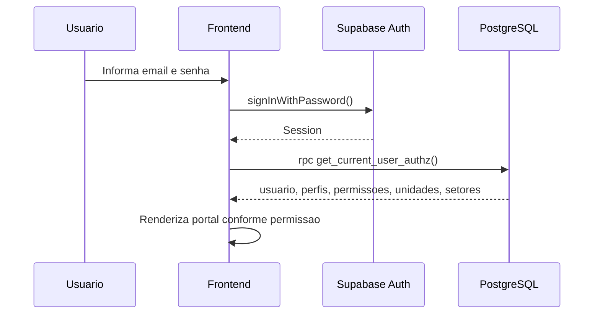

# Servidor 360 — Autenticação e Autorização

## 1. Objetivo

Este documento descreve como autenticação, perfis, permissões, escopo e RLS funcionam no Servidor 360.

## 2. Componentes

| Camada | Responsabilidade |
|---|---|
| Supabase Auth | Autentica o usuário e mantém a sessão. |
| `app_auth` | Guarda usuários da aplicação, perfis, permissões e vínculos de escopo. |
| RPC `get_current_user_authz()` | Retorna a autorização atual para o frontend. |
| Frontend | Mostra ou oculta rotas, cards e ações conforme permissões. |
| RLS/RPCs | Impõem a autorização real no banco. |

## 3. Fluxo de Login


```mermaid
sequenceDiagram
    participant U as Usuario
    participant F as Frontend
    participant A as Supabase Auth
    participant D as PostgreSQL

    U->>F: Informa email e senha
    F->>A: signInWithPassword()
    A-->>F: Session
    F->>D: rpc get_current_user_authz()
    D-->>F: usuario, perfis, permissoes, unidades, setores
    F->>F: Renderiza portal conforme permissao
```

## 4. Payload de Autorização

O frontend espera um payload no formato:

```ts
interface AuthzPayload {
  usuario: User | null
  perfis: string[]
  permissoes: Array<'*' | `${string}:${string}`>
  unidades: string[]
  setores?: string[]
}
```

Esse payload é carregado por `useCurrentUserAuthz()` e usado por:

- `ProtectedRoute`
- `Can`
- portal inicial
- regras de interface do módulo de afastamentos

## 5. Permissões

As permissões seguem o padrão:

```text
recurso:acao
```

Exemplos:

- `portal:read`
- `servidores:read`
- `afastamentos:create`
- `afastamentos:analisar`
- `afastamentos:emitir_devolutiva`
- `afastamentos:registrar_providencia`
- `afastamentos:gerar_documento`
- `afastamentos:assinar_documento`
- `afastamentos:validar_documento`
- `*`

As constantes ficam em `src/features/auth/constants/auth.constants.ts` e permissões específicas de afastamentos também aparecem em `src/features/afastamentos/constants/afastamentos.constants.ts`.

## 6. Escopo por Unidade e Setor

Usuários podem ser vinculados a unidades e setores. Esse escopo é usado para limitar consultas e ações.

Exemplo já implementado:

- gestor escolar só pode criar afastamento para servidor de unidade vinculada;
- documentos de afastamento respeitam permissões e escopo;
- leitura de processos usa políticas e funções auxiliares.

## 7. RLS e RPCs

O frontend pode esconder botões e rotas, mas a proteção efetiva ocorre no banco:

- tabelas possuem RLS;
- policies chamam helpers como `current_user_has_permission`;
- RPCs validam permissão antes de executar ações sensíveis;
- RPCs também validam escopo quando necessário.

Funções públicas de autorização:

- `current_user_has_role(role_name)`
- `current_user_has_permission(permission_name)`
- `current_user_has_unidade(unidade)`
- `current_user_is_gestor_escolar()`
- `current_user_can_access_afastamento(afastamento_uuid)`
- `current_user_can_access_ocupacional()`

## 8. Rotas Protegidas

Rotas principais:

| Rota | Proteção |
|---|---|
| `/login` | Pública |
| `/forgot-password` | Pública |
| `/reset-password` | Pública |
| `/portal` | Sessão autenticada |
| `/afastamentos` | `afastamentos:read` |
| `/afastamentos/novo` | `afastamentos:create` |
| `/validar-documento/:protocolo` | `afastamentos:validar_documento` |
| `/unauthorized` | Pública |

## 9. Assinatura Eletrônica Interna

A assinatura digital de afastamentos usa duas etapas:

1. O frontend confirma a senha do usuário autenticado.
2. A RPC `assinar_documento_digital_afastamento` valida permissão, escopo e status do documento antes de registrar a assinatura.

Cada assinatura registra:

- documento;
- usuário assinante;
- nome e e-mail do assinante;
- perfil informado;
- hash do documento;
- IP quando disponível;
- user agent;
- data/hora da assinatura.

## 10. Cuidados de Segurança

- Nunca confiar somente na permissão do frontend.
- Toda ação sensível precisa de validação no banco.
- Novas permissões precisam ser criadas em migration.
- Mudanças em permissões precisam atualizar constantes TypeScript.
- Informação ocupacional deve ter regra explícita de acesso.
- Documento assinado não deve ser editado diretamente; correções devem gerar nova versão, substituição ou complemento rastreável.
