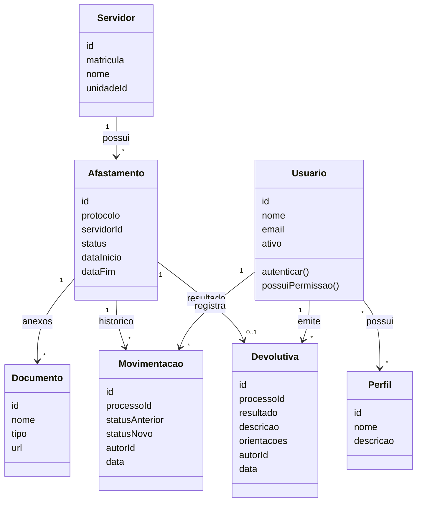

# Servidor 360 - Sprint de Autenticacao e Afastamentos

## 1. Apresentacao curta

O **Servidor 360** e um portal para centralizar a vida funcional do servidor publico em um ambiente digital, seguro e organizado.

Nesta sprint, o foco foi validar duas partes essenciais do sistema:

- **Autenticacao e autorizacao**, garantindo que cada usuario acesse apenas as areas permitidas.
- **Modulo de afastamentos**, permitindo registrar, acompanhar e tramitar processos de afastamento com historico e rastreabilidade.

A entrega demonstra o fluxo principal do usuario: entrar no sistema, acessar uma area protegida, registrar ou acompanhar um afastamento e confirmar que os dados ficam persistidos no banco.

---

## 2. Roteiro da apresentacao

1. Apresentar rapidamente o objetivo do projeto.
2. Mostrar o board da sprint no GitHub.
3. Demonstrar as funcionalidades funcionando no sistema.
4. Mostrar a tabela no banco com os dados persistidos.
5. Finalizar com caso de uso e diagrama de classes.

---

## 3. Funcionalidades por avaliacao

| Avaliacao | Funcionalidade 1 | Funcionalidade 2 | Evidencia principal |
| --- | --- | --- | --- |
| AC1 | Login de usuario | Protecao de rotas por autenticacao | Usuario acessa o portal somente apos autenticar |
| AC2 | Controle de permissao por perfil | Tela de acesso negado para usuario sem permissao | Usuario visualiza apenas modulos permitidos |
| AC3 | Registro de afastamento | Acompanhamento da situacao do afastamento | Processo fica registrado e consultavel |
| Prova | Analise/encaminhamento pelo CAS | Devolutiva formal e historico do processo | Caso de uso, diagrama de classes e banco persistido |

---

## 4. Board da sprint

**Board:** Autenticacao e Modulo Afastamento  
**Repositorio:** `marcosroberto-netizen/servidor360`  
**Objetivo da sprint:** entregar uma demonstracao completa, curta e apresentavel com autenticacao/autorizacao e fluxo inicial do modulo de afastamentos.

### Colunas do quadro

| Coluna | Significado |
| --- | --- |
| Backlog | Funcionalidades planejadas para a sprint |
| Todo | Itens escolhidos para desenvolvimento |
| In Progress | Itens em implementacao ou ajuste |
| Review | Itens prontos para conferencia antes da apresentacao |
| Done | Itens finalizados e demonstraveis |

### Itens do board

| Status sugerido | Issue | Funcionalidade | Entrega esperada |
| --- | --- | --- | --- |
| In Progress | [#2](https://github.com/marcosroberto-netizen/servidor360/issues/2) | Autenticacao de usuarios com JWT | Login, sessao ativa, logout e protecao de acesso |
| Todo | [#3](https://github.com/marcosroberto-netizen/servidor360/issues/3) | Registrar afastamento com envio de atestado | Cadastro do processo com servidor, dados principais e documento |
| Todo | [#5](https://github.com/marcosroberto-netizen/servidor360/issues/5) | Acompanhar afastamento | Consulta da situacao, pendencias e historico permitido |
| Todo | [#7](https://github.com/marcosroberto-netizen/servidor360/issues/7) | Analisar processo pelo CAS | CAS visualiza fila, abre processo e registra analise |
| Todo | [#8](https://github.com/marcosroberto-netizen/servidor360/issues/8) | Solicitar complementacao | CAS solicita correcao ou documento complementar |
| Todo | [#6](https://github.com/marcosroberto-netizen/servidor360/issues/6) | Responder complementacao | Diretor/unidade responde a pendencia no mesmo processo |
| Todo | [#9](https://github.com/marcosroberto-netizen/servidor360/issues/9) | Encaminhar para avaliacao | CAS encaminha para profissional autorizado |
| Todo | [#4](https://github.com/marcosroberto-netizen/servidor360/issues/4) | Emitir devolutiva formal | Profissional registra resultado, orientacoes, autor, data e hora |

---

## 5. Ordem recomendada para apresentar o board

### AC1 - Entrada segura no sistema

- **Issue #2:** Autenticacao de usuarios com JWT.
- Demonstrar login valido.
- Demonstrar acesso ao portal apos autenticacao.

### AC2 - Autorizacao e controle de acesso

- Usar a mesma entrega da autenticacao para mostrar permissao por perfil.
- Demonstrar rota protegida ou tela de acesso negado.
- Explicar que o sistema separa o que cada perfil pode visualizar.

### AC3 - Afastamento registrado e acompanhado

- **Issue #3:** Registrar afastamento.
- **Issue #5:** Acompanhar afastamento.
- Demonstrar criacao do processo e consulta da situacao.
- Mostrar que o processo aparece persistido no banco.

### Prova - Fluxo do CAS e fechamento conceitual

- **Issue #7:** Analisar processo pelo CAS.
- **Issue #4:** Emitir devolutiva formal.
- Relacionar a demonstracao com o caso de uso do modulo.
- Finalizar mostrando o diagrama de classes.

---

## 6. Caso de uso principal

**Caso de uso:** Registrar e tramitar afastamento.

**Ator principal:** Diretor ou unidade escolar.

**Atores envolvidos:** CAS, profissional autorizado e RH.

**Fluxo resumido:**

1. Usuario autenticado acessa o modulo de afastamentos.
2. Sistema valida suas permissoes.
3. Usuario seleciona o servidor.
4. Usuario registra os dados do afastamento.
5. Usuario anexa o documento de origem.
6. Sistema gera protocolo e salva o processo.
7. CAS analisa o processo.
8. CAS pode solicitar complementacao ou encaminhar para avaliacao.
9. Profissional autorizado emite devolutiva.
10. Sistema registra historico e mantem a rastreabilidade.

---

## 7. Diagrama de classes resumido

---

## 8. Fechamento

Com esta sprint, o projeto demonstra o ponto central do Servidor 360: acesso seguro, permissao por responsabilidade e processo de afastamento registrado com dados persistidos, historico e rastreabilidade.
