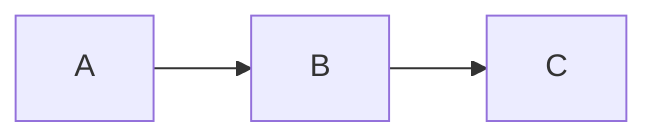

# Guia de Contribuição à Documentação

Este guia define os padrões e convenções para contribuir com a documentação do Servidor 360.

## 📝 Princípios Gerais

### Clareza e Simplicidade
- Escreva de forma direta e objetiva
- Evite jargões desnecessários
- Use exemplos quando ajudar na compreensão
- Mantenha o foco no "porquê" e "como", não apenas no "o quê"

### Consistência
- Siga os padrões de nomenclatura estabelecidos
- Mantenha a estrutura organizacional definida
- Use formatação consistente em todos os documentos
- Siga o estilo de escrita existente

### Manutenibilidade
- Documentação deve ser fácil de atualizar
- Evite duplicação de conteúdo
- Use referências cruzadas em vez de repetir
- Mantenha documentos focados e coesos

## 🗂️ Estrutura de Arquivos

### Convenção de Nomenclatura

**Arquivos de documentação:**
- Use kebab-case (ex: `descricao-geral.md`)
- Nomes descritivos e em português
- Prefixo numérico para ordenação (01-, 02-, etc.)
- Evite caracteres especiais além de hífens

**Pastas:**
- Use kebab-case (ex: `casos-de-uso`)
- Nomes descritivos e em português
- Mantenha estrutura hierárquica lógica

### Organização de Pastas

```text
docs/
├── 00-descricao/          # Visão geral e conceitos
├── 02-requisitos/         # Requisitos funcionais e não funcionais
│   ├── global/           # Requisitos do núcleo global
│   └── modulos/          # Requisitos específicos por módulo
├── 03-casos-de-uso/       # Atores e casos de uso
│   ├── global/           # Casos de uso do núcleo global
│   └── modulos/          # Casos de uso específicos por módulo
├── 04-arquitetura/        # Documentação técnica
└── README.md             # Índice principal
```

## 📐 Padrões de Conteúdo

### Cabeçalhos

Use cabeçalhos markdown de forma hierárquica:

```markdown
# Título Principal (H1)
## Seção Principal (H2)
### Subseção (H3)
#### Detalhe (H4)
```

**Regras:**
- Cada documento deve ter um H1
- Não pule níveis (H1 → H3)
- Use camelCase para títulos em português
- H1 deve ser o título do documento

### Listas

**Listas numeradas:**
```markdown
1. Primeiro item
2. Segundo item
3. Terceiro item
```

**Listas com marcadores:**
```markdown
- Item principal
  - Subitem
  - Outro subitem
- Outro item principal
```

### Tabelas

Use tabelas para apresentar dados estruturados:

```markdown
| Coluna 1 | Coluna 2 | Coluna 3 |
|----------|----------|----------|
| Dado 1   | Dado 2   | Dado 3   |
| Dado 4   | Dado 5   | Dado 6   |
```

### Código

**Blocos de código:**
````markdown
```javascript
const exemplo = "código";
```
````

**Código inline:**
```markdown
Use `variavel` para referenciar variáveis no texto.
```

### Diagramas

Use Mermaid para diagramas:

```markdown

```

**Tipos de diagramas comuns:**
- `flowchart` para fluxogramas
- `classDiagram` para diagramas de classes
- `erDiagram` para diagramas entidade-relacionamento
- `sequenceDiagram` para diagramas de sequência

### Links e Referências

**Links internos:**
```markdown
[Texto do link](../pasta/arquivo.md)
```

**Links externos:**
```markdown
[Texto do link](https://exemplo.com)
```

**Referências a seções:**
```markdown
Veja a seção [Nome da Seção](#nome-da-secao)
```

## 🎯 Padrões por Tipo de Documento

### Documentos de Requisitos

**Estrutura recomendada:**
```markdown
# Título do Documento

## 1. Objetivo
Breve descrição do propósito do documento.

## 2. Escopo
O que está incluído e excluído.

## 3. Requisitos Funcionais
## RF-XX — Título do Requisito
Descrição clara do requisito.

## 4. Regras de Negócio
## RN-XX — Título da Regra
Descrição clara da regra.

## 5. Requisitos Não Funcionais
## RNF-XX — Título do Requisito
Descrição clara do requisito não funcional.

## 6. Critérios de Aceite
Lista de critérios para validação.
```

**Nomenclatura de requisitos:**
- Funcionais: `RF-[PREFIXO]-XX` (ex: `RF-G01`, `RF-A01`)
- Não funcionais: `RNF-[PREFIXO]-XX` (ex: `RNF-G01`)
- Regras de negócio: `RN-[PREFIXO]-XX` (ex: `RN-G01`)

### Documentos de Casos de Uso

**Estrutura recomendada:**
```markdown
# Título do Documento

## 1. Objetivo
Breve descrição do propósito.

## 2. Atores
Descrição dos atores envolvidos.

## UC-XX — Nome do Caso de Uso

**Ator:** Nome do ator

**Objetivo:** Objetivo do caso de uso

**Pré-condição:** Condição necessária

**Fluxo principal:**
1. Passo 1
2. Passo 2
3. Passo 3

**Fluxos alternativos:**
- Alternativa 1
- Alternativa 2

**Pós-condição:** Resultado esperado
```

**Nomenclatura de casos de uso:**
- Globais: `UC-GXX` (ex: `UC-G01`)
- Por módulo: `UC-[MODULO]-XX` (ex: `UC-A01`)

### Documentos Técnicos

**Estrutura recomendada:**
```markdown
# Título do Documento

## 1. Objetivo
Propósito do documento técnico.

## 2. Diagramas/Modelos
Incluir diagramas UML, DER, etc.

## 3. Descrição Detalhada
Explicação dos componentes.

## 4. Decisões Arquiteturais
Justificativa para escolhas técnicas.

## 5. Considerações de Implementação
Detalhes práticos para desenvolvimento.
```

## ✅ Checklist de Revisão

Antes de submeter uma alteração na documentação, verifique:

- [ ] Nomenclatura de arquivos segue o padrão kebab-case
- [ ] Estrutura de pastas está correta
- [ ] Cabeçalhos estão hierarquicamente corretos
- [ ] Links internos funcionam corretamente
- [ ] Diagramas Mermaid são válidos
- [ ] Tabelas estão formatadas corretamente
- [ ] Código está identificado com a linguagem correta
- [ ] Ortografia e gramática estão corretas
- [ ] Conteúdo é claro e objetivo
- [ ] Não há duplicação de conteúdo
- [ ] Referências cruzadas estão atualizadas
- [ ] README.md principal está atualizado se necessário

## 🔄 Processo de Atualização

### Para Alterações Menores
1. Faça as alterações diretamente no arquivo
2. Revise seguindo o checklist
3. Atualize o índice se necessário
4. Commit com mensagem descritiva

### Para Novos Documentos
1. Crie o arquivo na localização apropriada
2. Siga o padrão do tipo de documento
3. Adicione referência no README.md
4. Revise seguindo o checklist
5. Commit com mensagem descritiva

### Para Reestruturação
1. Planeje as mudanças antecipadamente
2. Atualize README.md primeiro
3. Mova/renomeie arquivos
4. Atualize referências internas
5. Revise todos os links
6. Teste a navegação completa

## 🛠️ Ferramentas Recomendadas

### Editores
- VS Code com extensão Markdown Preview Enhanced
- Typora (editor WYSIWYG)
- Obsidian (para organização pessoal)

### Validação
- Markdownlint (lint para markdown)
- Mermaid Live Editor (validação de diagramas)

### Visualização
- GitHub (renderização nativa)
- VS Code (preview integrado)
- Docusaurus (para sites de documentação)

## 📞 Suporte

Se tiver dúvidas sobre a documentação:

1. Consulte os documentos existentes como exemplos
2. Verifique este guia
3. Entre em contato com a equipe responsável

---

**Lembre-se:** Boa documentação é tão importante quanto bom código. Mantenha-a atualizada, clara e útil para todos os envolvidos no projeto.
