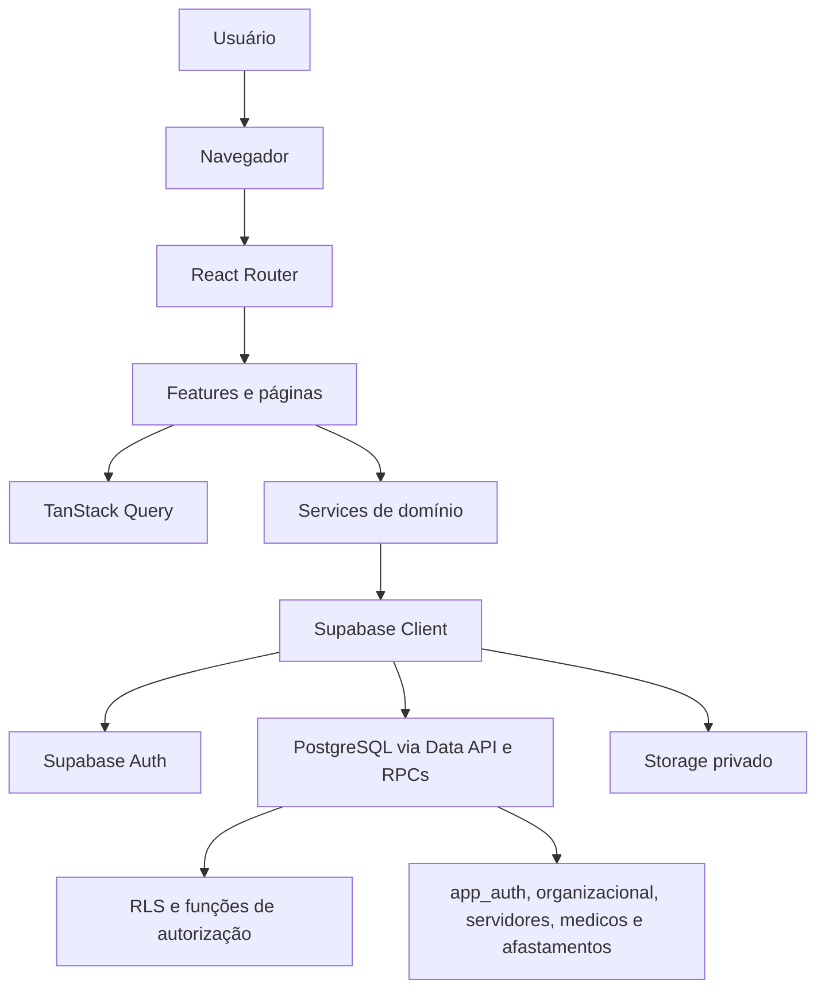
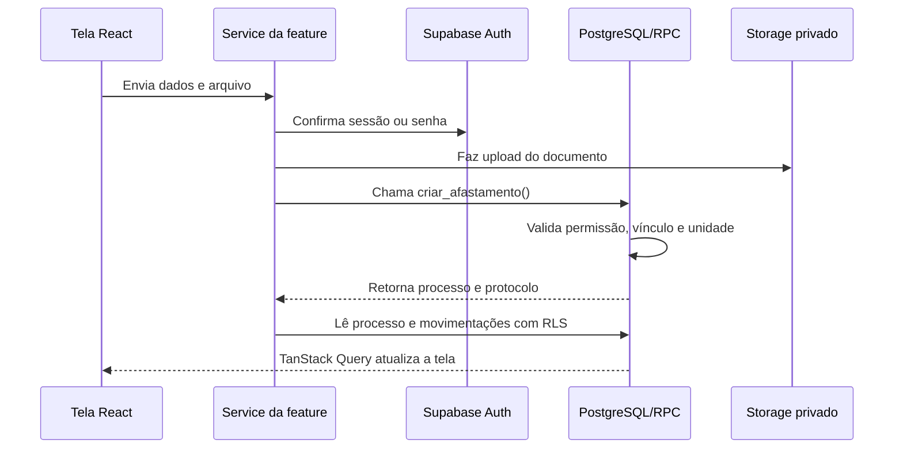

# Arquitetura do sistema

Este documento explica onde o sistema executa cada responsabilidade. Ele cobre o frontend React, o cliente Supabase, a autorização e o fluxo principal de dados.

## Visão geral

O repositório não contém Edge Functions nem integrações externas identificadas. A lógica de backend está nas migrations, funções PostgreSQL, RLS, Auth e Storage do Supabase.

## Camadas do frontend

| Camada | Responsabilidade | Localização |
| --- | --- | --- |
| Bootstrap | Monta providers e o roteador | `src/main.tsx`, `src/app/` |
| Rotas | Lazy loading, sessão e permissões | `src/app/routes/` |
| Features | Telas, componentes, hooks, services e tipos por domínio | `src/features/` |
| Páginas globais | Login, portal, recuperação de senha e acesso negado | `src/pages/` |
| Shared | Cliente Supabase, ambiente, cache e UI compartilhada | `src/shared/` |

Cada feature expõe sua API pública por `index.ts`. Services chamam o Supabase; componentes não devem acessar o cliente diretamente. Dados remotos usam TanStack Query e estado local permanece no componente ou no hook da tela.

## Rotas atuais

| Rota | Acesso | Implementação |
| --- | --- | --- |
| `/login` | Pública | Login |
| `/forgot-password` | Pública | Recuperação de senha |
| `/reset-password` | Pública | Redefinição de senha |
| `/portal` | Sessão | Portal por permissão |
| `/afastamentos` | `afastamentos:read` | Visão operacional |
| `/afastamentos/educacao` | `educacao:read` | Visão administrativa da Educação |
| `/afastamentos/cas` | `cas:fila` | Fila do CAS |
| `/afastamentos/dp` | `rh:fila` | Fila do DP |
| `/validar-documento/:protocolo` | `afastamentos:validar_documento` | Validação interna |
| `/unauthorized` | Pública | Acesso negado |

As rotas são definidas em `src/app/routes/index.tsx` e carregadas sob demanda. `ProtectedRoute` protege a sessão e a permissão de entrada; RLS e RPCs continuam sendo a autoridade de segurança.

## Autenticação e autorização

1. O frontend chama `signInWithPassword()` no Supabase Auth.
2. O `AuthProvider` acompanha a sessão com `onAuthStateChange()`.
3. `useCurrentUserAuthz()` chama `get_current_user_authz()`.
4. O portal e os componentes `ProtectedRoute` e `Can` filtram a interface.
5. Policies e RPCs repetem as verificações no banco.

O payload de autorização reúne usuário, perfis, permissões, unidades e setores. A permissão usa o formato `recurso:acao`; o curinga `*` representa acesso administrativo amplo no frontend.

## Fluxo de dados do afastamento

O processo usa RPCs para mutações sensíveis. Leituras operacionais usam Data API com RLS e, quando precisam combinar schemas ou ocultar campos, usam funções de fachada.

## Onde alterar

- Nova rota: `src/app/routes/` e a feature responsável
- Nova tela de domínio: `src/features/<modulo>/pages/`
- Acesso a dados: `src/features/<modulo>/services/`
- Consulta ou mutation: `src/features/<modulo>/hooks/`
- Autorização de interface: `src/features/auth/` e constantes da feature
- Regra de segurança: migration, policy ou RPC no Supabase
- UI reutilizável: `src/shared/components/`
