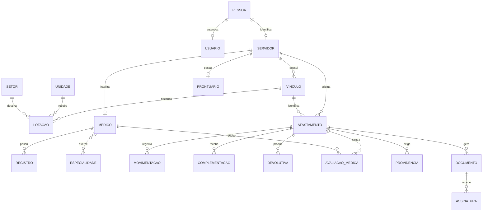

# Banco de dados e Supabase

O banco usa migrations SQL imperativas no Supabase. Os schemas separam autorização, estrutura organizacional, vida funcional, habilitação médica e processos de afastamento.

## Modelo de domínio



## Schemas e tabelas principais

| Schema | Tabelas relevantes | Finalidade |
| --- | --- | --- |
| `app_auth` | `usuarios`, `perfis`, `permissoes`, `usuario_perfis`, `perfil_permissoes`, `usuario_unidades`, `usuario_setores`, `notificacoes` | Identidade da aplicação, RBAC, escopo e central de notificações |
| `organizacional` | `pastas`, `tipos_unidade`, `unidades`, `setores` | Estrutura administrativa |
| `servidores` | `pessoas`, `servidores`, `cargos`, `funcoes`, `regimes_vinculo`, `vinculos_funcionais`, `lotacoes_funcionais`, `exercicios_funcionais`, `prontuarios` | Cadastro e histórico funcional |
| `medicos` | `medicos`, `registros_profissionais`, `especialidades`, `medico_especialidades`, `locais_atendimento` | Habilitação médica de servidores |
| `afastamentos` | `afastamentos`, `movimentacoes`, `complementacoes`, `avaliacoes_medicas`, `devolutivas`, `providencias`, `documentos_digitais`, `assinaturas_digitais`, `notificacoes` | Tramitação do processo, atribuições, notificações e documentos formais |

O schema `public` contém fachadas RPC e helpers de autorização. As tabelas de negócio ficam nos schemas proprietários.

## Regras de integridade

- UUID identifica as entidades principais
- CPF possui 11 dígitos quando informado
- Datas finais não podem anteceder datas iniciais
- Uma lotação só pode apontar para um setor da mesma unidade
- Cada servidor pode ter vários vínculos e cada afastamento guarda o vínculo afetado
- Vínculos, lotações e exercícios preservam vigência e histórico
- Funções de exercício referenciam cargos do catálogo
- Processos registram movimentações, em vez de substituir o histórico
- Documentos assinados preservam conteúdo, hash SHA-256, protocolo e assinaturas

## RLS e Storage

Row-Level Security (RLS) está habilitado nas tabelas expostas. Policies combinam permissão, autenticação e escopo de unidade ou processo. As funções `current_user_can_access_servidor()` e `current_user_can_access_afastamento()` concentram verificações reutilizadas.

O bucket privado `afastamentos-documentos` aceita PDF, JPEG, PNG e WebP até 10 MB. A leitura exige `afastamentos:visualizar_documento` e, para gestores escolares, também exige vínculo com a unidade do servidor. O frontend gera URLs assinadas por 10 minutos.

## RPCs de domínio

As mutações sensíveis ficam atrás de RPCs. Entre as principais estão:

- `get_current_user_authz()`
- `criar_afastamento(jsonb)`
- `registrar_triagem_afastamento(..., target_medico_id uuid)`: vincula a
  avaliação à coluna `afastamentos.avaliacoes_medicas.medico_id`.
- `registrar_triagem_afastamento(..., target_medico_id uuid,
  permitir_reatribuicao boolean)`: transfere uma avaliação pendente somente
  quando a intenção de reatribuir foi informada explicitamente; preserva a
  atribuição anterior como `cancelada` para auditoria.
- `list_medicos_para_avaliacao()`
- `registrar_analise_afastamento(...)`
- `responder_complementacao_afastamento(...)`
- `emitir_devolutiva_afastamento(...)`
- `registrar_providencia_afastamento(...)`
- `gerar_documento_digital_afastamento(...)`
- `assinar_documento_digital_afastamento(...)`
- `validar_documento_digital_afastamento(...)`
- `get_vinculos_resumo_for_afastamentos(uuid[])`
- `get_movimentacoes_afastamento(uuid)`: retorna a linha do tempo visível com
  o identificador e o nome do usuário responsável por cada ação.
- `listar_minhas_notificacoes(integer)` e
  `contar_minhas_notificacoes_pendentes()`: alimentam a central do portal com
  dados limitados ao usuário autenticado.
- `marcar_notificacao_lida(uuid)` e `marcar_todas_notificacoes_lidas()`:
  atualizam somente notificações do destinatário autenticado, sob RLS.

## Central de notificações

`app_auth.notificacoes` recebe eventos de qualquer módulo. Cada item informa
`modulo`, `evento`, `prioridade`, entidade relacionada, rota interna opcional e
metadados JSON. A interface não interpreta regras de domínio; ela apenas exibe
o contrato comum e navega para uma rota interna validada.

Funções de domínio executadas no banco publicam eventos com
`app_auth.publicar_notificacao(...)`. A função é interna: `anon` e
`authenticated` não possuem `execute`. Exemplo para uma futura exoneração:

```sql
perform app_auth.publicar_notificacao(
  target_usuario_id,
  'exoneracoes',
  'exoneracao_publicada',
  'Exoneração publicada',
  'O ato de exoneração foi publicado e requer ciência.',
  'alta',
  'servidor',
  target_servidor_id,
  '/servidores',
  jsonb_build_object('ato_id', target_ato_id),
  'exoneracoes:' || target_ato_id::text || ':' || target_usuario_id::text
);
```

`origem_chave` torna a publicação idempotente. O módulo de afastamentos
continua escrevendo na tabela legada e um trigger sincroniza seus eventos com a
central, preservando compatibilidade durante a transição.

### Destinatários dos afastamentos

O banco publica notificações automaticamente no `insert` do afastamento e em
toda alteração efetiva de `status`:

- novo atestado enviado pela escola: CAS (`cas:fila`), DP (`rh:fila`) e
  Educação (`educacao:read`);
- estado alterado: CAS, DP, Educação e o usuário escolar que criou o processo;
- avaliação médica atribuída: adicionalmente, somente o médico selecionado.

O usuário que realizou a ação é removido dos destinatários. A escola é
representada pelo campo auditável `iniciado_por`, pois o envio é centralizado em
um usuário autorizado, e não realizado individualmente por cada servidor.

As notificações exibem protocolo, estado e área responsável, sem incluir
motivo, diagnóstico, documento ou outro conteúdo ocupacional sensível.

Consulte as assinaturas diretamente nas migrations antes de chamar uma RPC nova. Funções `security definer` devem manter `search_path`, autenticação, permissão, escopo e grants explícitos.

## Migrations

As migrations ficam em `supabase/migrations`. O projeto usa schemas SQL, não `supabase/schemas/`. O procedimento de criação, prévia, aplicação e validação está em [Desenvolvimento](development.md#alterar-o-banco).
