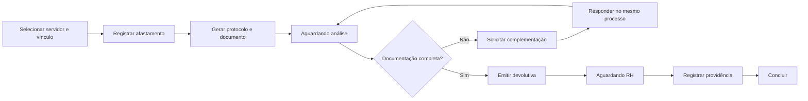

# Fluxos e status do produto

Este documento separa o comportamento implementado do backlog conhecido. Requisitos futuros não devem ser lidos como funcionalidades disponíveis.

## Módulo de afastamentos

O fluxo implementado é:

O módulo oferece criação, análise, complementação, devolutiva, providência, conclusão, timeline, filtro, busca, ordenação, paginação, exportação, documento digital, assinatura interna e validação por protocolo.

## Perfis e escopo

| Perfil ou área | Responsabilidade no fluxo |
| --- | --- |
| Gestor escolar | Registra e acompanha afastamentos dentro das unidades vinculadas |
| Educação | Acompanha a visão administrativa da Educação |
| CAS | Analisa, solicita complementação e encaminha avaliação |
| Médico ou profissional autorizado | Emite devolutiva formal quando habilitado |
| RH ou DP | Registra providência e conclui a etapa administrativa |
| Administrador | Possui permissões administrativas conforme o RBAC configurado |

A interface filtra ações por permissão, mas o banco valida a autorização novamente. O acesso a documento e informação ocupacional possui permissões específicas.

## Estados do processo

`rascunho`, `registrado`, `encaminhado`, `aguardando_analise`, `em_analise`, `aguardando_complementacao`, `aguardando_avaliacao`, `avaliado`, `aguardando_rh` e `concluido`.

## Assinatura e validação

O documento digital é gerado com conteúdo e hash SHA-256. A assinatura confirma a senha do usuário no frontend e chama uma RPC que valida permissão, escopo e status. O registro guarda assinante, perfil informado, data, user agent e IP quando disponível.

A validação por protocolo é interna e protegida pela permissão `afastamentos:validar_documento`. Ela não equivale a certificado ICP-Brasil ou assinatura GOV.BR.

## Backlog confirmado

- CRUD administrativo de usuários, perfis, permissões, unidades e setores
- Consulta global de servidores e prontuário funcional
- Módulo global de documentos e auditoria de acesso
- Indicadores gerais
- Interface específica para a fila de médico, se permanecer no escopo
- Versionamento ou substituição de documentos digitais na interface
- Testes automatizados de autenticação, RPCs e fluxos de UI
- Definição de uma experiência completa de QR Code
